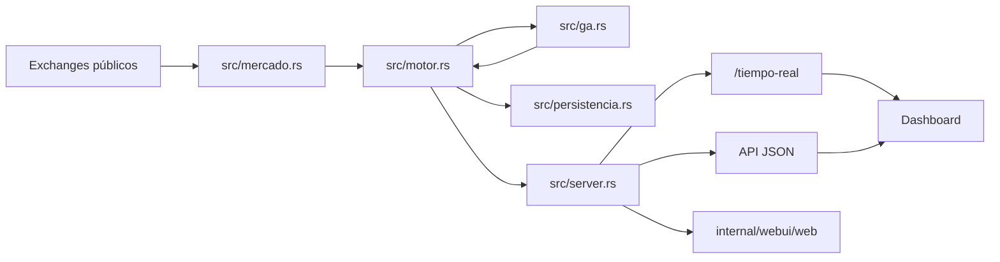

# Arquitectura de Mayab Arbitraje BTC

Este documento explica la estructura del proyecto para que sea claro dónde leer,
probar o modificar cada pieza. El sistema es un solo binario Rust con frontend
estático servido por Axum. No ejecuta trading real: solo consume datos públicos y
modifica estado simulado en memoria.

## Vista Rápida

```text
.
├── Cargo.toml                  dependencias, perfiles y metadatos Rust
├── src/
│   ├── main.rs                 arranque del proceso y cableado principal
│   ├── config.rs               variables de entorno y defaults seguros
│   ├── mercado.rs              feeds WebSocket y REST fallback público
│   ├── motor.rs                decisión, simulación, carteras y demos
│   ├── ga.rs                   algoritmo genético y estrategia aprendida
│   ├── persistencia.rs         auditoría SQLite local
│   ├── server.rs               API HTTP, WebSocket local y estáticos
│   └── types.rs                contratos JSON compartidos
├── internal/webui/web/
│   ├── index.html              estructura del dashboard
│   ├── app.js                  interacciones, render y llamadas API
│   ├── styles.css              layout responsive y tema visual
│   └── shader.js               efectos canvas aislados
├── scripts/
│   ├── smoke-demo.sh           smoke funcional contra una URL activa
│   ├── release-check.sh        validación completa de release local
│   ├── deploy-cloud-run.sh     despliegue principal
│   └── run.sh                  arranque con Docker
├── docs/defensa-comite.md      guion de defensa y demo
├── README.md                   entrada principal para usuario/evaluador
└── AGENTS.md                   reglas operativas para cambios asistidos
```

## Responsabilidades

| Archivo | Responsabilidad | Cambiar aquí cuando |
| --- | --- | --- |
| `src/main.rs` | Inicializa logs, config, persistencia, feeds, motor y router. | Cambie el arranque global del binario. |
| `src/config.rs` | Lee variables de entorno y normaliza valores inválidos. | Agregues un parámetro operativo o costo configurable. |
| `src/mercado.rs` | Conecta exchanges públicos, parsea libros y normaliza cotizaciones. | Agregues un exchange, par o parser de market data. |
| `src/motor.rs` | Evalúa rutas, costos, riesgo, carteras, rebalanceos y escenarios demo. | Cambie la lógica de arbitraje, PnL, riesgo o simulación. |
| `src/ga.rs` | Evoluciona pesos, umbrales, tamaño y tolerancia de latencia. | Cambie selección, cruce, mutación, fitness o config GA. |
| `src/persistencia.rs` | Guarda evidencia local en SQLite. | Cambie auditoría durable o esquema local. |
| `src/server.rs` | Expone endpoints, WebSocket del dashboard, exports y preflight. | Cambie API, validaciones HTTP, auth admin o respuestas JSON. |
| `src/types.rs` | Define el contrato de dominio serializado con Serde. | Cambie campos que consumen API, UI, exports o tests. |
| `internal/webui/web/app.js` | Consume WebSocket/API y renderiza paneles. | Cambie UX, controles POST, gráficas o transformación de estado. |
| `internal/webui/web/index.html` | Estructura semántica del dashboard. | Agregues o retires paneles visibles. |
| `internal/webui/web/styles.css` | Sistema visual responsive. | Cambie layout, colores, densidad o mobile. |

## Flujo de Ejecución

1. `main.rs` carga `Config::from_env()`.
2. `main.rs` abre SQLite con `Persistencia::abrir()`; si falla, la demo sigue en
   memoria y reporta la auditoría como desactivada.
3. `mercado::start_feeds()` crea tareas Tokio para WebSocket y REST fallback.
4. `Motor::start()` corre el ciclo de análisis cada `INTERVALO_ANALISIS_MS`.
5. El motor guarda cotizaciones, calcula oportunidades y aplica guardas de
   riesgo antes de simular operaciones.
6. `server::router()` expone API, WebSocket `/tiempo-real` y archivos estáticos.
7. `app.js` recibe `EstadoPublico`, renderiza el dashboard y envía mutaciones
   simuladas por POST.



## Contratos y Fronteras

- `types.rs` es la frontera estable entre backend, frontend, exports y tests.
- Los nombres Rust usan `snake_case`; los nombres JSON públicos se fijan con
  `#[serde(rename = "...")]` cuando el dashboard espera `camelCase`.
- `server.rs` debe validar entradas HTTP antes de llamar al motor.
- `motor.rs` no debe depender del DOM ni de textos de UI.
- `mercado.rs` no debe tomar decisiones de arbitraje; solo normaliza datos.
- `ga.rs` no debe conocer HTTP; recibe historial y publica estado serializable.
- `persistencia.rs` guarda evidencia, pero no debe bloquear la demo si SQLite
  falla al arrancar.

## Estado Compartido

El estado principal vive dentro de `Motor`:

- `RwLock<State>` serializa lectura/escritura del estado simulado.
- `AtomicBool ejecucion_en_curso` evita dos ejecuciones simultáneas.
- `VecDeque` mantiene ventanas acotadas para operaciones, eventos, auditoría,
  series y oportunidades.
- `EstadoGa` vive dentro del estado del motor para que la estrategia aprendida y
  las métricas se publiquen juntas.

La persistencia SQLite es auxiliar. La fuente de verdad operativa durante la demo
es el estado en memoria.

## Endpoints por Tipo

Lectura:

- `GET /healthz`
- `GET /api/estado`
- `GET /api/preflight`
- `GET /api/resumen-llm`
- `GET /api/paquete-evaluacion`
- `GET /api/backtest`
- `GET /api/lab/sweep`
- `GET /api/export/json`
- `GET /api/export/csv`
- `GET /api/ga/estado`
- `GET /api/ga/config`

Mutación simulada:

- `POST /api/config`
- `POST /api/demo`
- `POST /api/demo/final`
- `POST /api/ga/config`
- `POST /api/ga/evolucionar`
- `POST /api/exchanges`

Si `ADMIN_TOKEN` existe, los endpoints mutables requieren `Authorization:
Bearer <token>` o `X-Admin-Token`.

## Cómo Hacer Cambios Sin Romper la Estructura

- Si agregas un campo a `EstadoPublico`, actualiza `types.rs`, `server.rs` si lo
  compacta/exporta, `app.js` si se muestra, y tests si participa en la demo.
- Si cambias cálculos del motor, agrega o ajusta tests en `src/motor.rs`.
- Si cambias GA, valida `/api/ga/evolucionar` con historial real y con
  `usarReplaySiVacio=true`.
- Si agregas un POST, usa el formato de error `ErrorApi` de `server.rs`.
- Si agregas UI visible, mantén el texto en español y conserva en inglés solo
  siglas, nombres de producto, nombres de campos JSON o términos técnicos que ya
  son contrato.
- Si agregas promesas al `README.md`, deben existir en API, UI, smoke o docs.

## Verificación Recomendada

```bash
cargo fmt -- --check
cargo clippy --all-targets -- -D warnings
cargo test
node --check internal/webui/web/app.js
```

Con servidor local activo:

```bash
curl -sS http://127.0.0.1:8080/healthz
curl -sS http://127.0.0.1:8080/api/preflight
curl -sS -X POST http://127.0.0.1:8080/api/demo \
  -H 'Content-Type: application/json' \
  -d '{"escenario":"mercado_rentable"}'
curl -sS http://127.0.0.1:8080/api/estado
```
