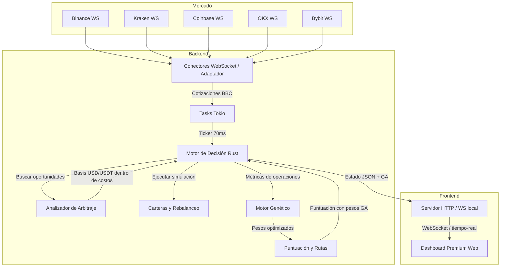

# Mayab Arbitraje BTC — Arbitraje simulado y optimización genética

[Aplicación pública en Cloud Run](https://mayab-btc-arbitrage-3erllnacaa-uc.a.run.app)

Mayab Arbitraje BTC es un sistema inteligente de arbitraje de Bitcoin en tiempo real con optimización evolutiva mediante **algoritmo genético single-objetivo con metaheurísticas híbridas** (elitismo, recocido simulado, evolución diferencial, reinicio adaptativo). Monitorea libros de órdenes de criptomonedas en 10 exchanges simultáneamente, detecta oportunidades de arbitraje tradicional y triangular, simula ejecuciones con costos realistas, y **evoluciona automáticamente su estrategia de selección** usando un motor genético que optimiza pesos, umbrales y tolerancias.

El sistema corre como un solo binario Rust: conexiones WebSocket concurrentes sobre Tokio, motor de decisión, simulador de carteras, optimización genética ligera, API Axum e interfaz web servida por el mismo proceso. Esa arquitectura reduce latencia operativa, simplifica el despliegue y permite demostrar el sistema en vivo sin una cadena pesada de servicios.

## Jurado en 60 segundos

1. Abre la [aplicación pública](https://mayab-btc-arbitrage-3erllnacaa-uc.a.run.app) y revisa el badge LIVE/DEMO/REST, P&L, mapa de rutas, wallets, eventos y panel GA. Si prefieres una visita guiada, pulsa **Recorrido de 2 min** en el encabezado; es opcional.
2. Abre `/api/jurado`: concentra rúbrica, scorecard, cobertura finalista, checks, evidencia clave y links de auditoría.
3. Abre `/api/preflight`: confirma `judgeReadiness.status=ready`, checks completos y la rúbrica oficial de 5 criterios.
4. Pulsa **Preparar demo auditada** en el resumen o **Preparar recorrido completo** en Demo controlada. Cada ejecución reinicia primero el estado simulado y después inyecta una dislocación sintética etiquetada, operaciones, PnL positivo, fill parcial, rebalanceo, auditoría y evolución genética; así una visita o doble clic no infla las métricas.
5. Pulsa **Forzar rebalanceo**: demuestra gestión de wallets con movimiento interno auditado y costo explícito.
6. Abre `/api/paquete-evaluacion`: verás scorecard, huella de auditoría, recomendaciones finales, backtest reproducible, evidencia SQLite y diferenciadores listos para revisión.

Validación automática equivalente:

```bash
./scripts/smoke-demo.sh
BASE_URL=https://tu-url-publica ./scripts/smoke-demo.sh
```

Lo importante: el proyecto no intenta impresionar con spreads brutos. Cada ruta pasa por costos, profundidad, inventario, latencia, riesgo, auditoría y estrategia GA; si el mercado real está plano, la demo rentable queda marcada como sintética para probar el flujo sin fingir profit live.

## Alcance seguro del MVP

Este proyecto está diseñado como MVP demostrable y seguro para evaluación técnica:

- No guarda llaves API de exchanges.
- No firma órdenes reales.
- No custodia fondos.
- No hace depósitos, retiros ni transferencias on-chain.
- No puede cobrar comisiones reales: las comisiones, retiros, slippage y balances son parámetros de simulación.
- Los WebSockets de mercado consumen datos públicos.
- Los endpoints POST modifican únicamente el estado simulado del proceso y los parámetros visibles del dashboard.
- En despliegues protegidos, define `ADMIN_TOKEN` para exigir `Authorization: Bearer <token>` o `X-Admin-Token` en los endpoints mutables.

La URL pública se puede desplegar sin `ADMIN_TOKEN` para que el comité pueda probarla. Si se quisiera convertir en producto con dinero real, la primera tarea no sería conectar órdenes, sino endurecer autenticación/autorización, rate limiting, auditoría, aislamiento de secretos, permisos por exchange y límites duros de exposición.

## Cumplimiento, privacidad y crecimiento futuro

El sistema está delimitado como demo técnica: no recibe depósitos, no custodia activos virtuales, no ejecuta órdenes por cuenta de clientes y no promete rendimientos. Esa separación es intencional para no cruzar el límite hacia un servicio financiero regulado.

Si el proyecto creciera hacia trading real, custodia, asesoría, ejecución para terceros o manejo de fondos, el roadmap debe abrir una fase regulatoria antes de escribir conectores privados: revisión bajo el marco fintech mexicano, autorización aplicable ante autoridades financieras, controles KYC/AML, administración de riesgos, bitácora auditable, segregación de secretos, autorización por operación y disclosures claros sobre volatilidad, irreversibilidad y riesgos tecnológicos de activos virtuales.

Privacidad del dashboard:

- No usa cookies.
- No genera identificadores persistentes de visitante.
- No envía datos personales al backend.
- `localStorage` solo se usa para tema visual, modo debug local, coordinación local de auto-GA entre pestañas y, opcionalmente, un `mayabAdminToken` que el operador puede definir manualmente en despliegues protegidos.
- El modo debug solo se activa con `?debug=1` o `localStorage.mayabDebug=1`.

Contrato HTTP:

- Los endpoints de lectura devuelven JSON estable.
- Los endpoints mutables devuelven `{"ok":true}` en éxito.
- Los errores de endpoints mutables usan `{"ok":false,"error":{"code":"...","message":"..."}}`, para que UI, scripts y pruebas puedan reaccionar sin parsear texto libre.
- El servidor emite headers básicos de hardening: `X-Content-Type-Options`, `X-Frame-Options`, `Referrer-Policy`, `Permissions-Policy` y `Content-Security-Policy`.

## Virtudes principales

- **Algoritmo Genético Híbrido single-objetivo**: población en memoria, elitismo, torneo, cruce uniforme, mutación gaussiana, **recocido simulado**, **evolución diferencial** y **reinicio adaptativo** para evolucionar pesos, umbral, tamaño de orden y tolerancia a latencia.
- **Scoring adaptativo**: Los pesos de la función de puntuación (utilidad, frescura, liquidez, confiabilidad, Z-Score) son optimizados genéticamente, no fijos.
- **Metaheurísticas híbridas**: Combina GA clásico con recocido simulado, evolución diferencial y reinicio por convergencia para escapar de óptimos locales.
- **Detección de convergencia y reinicio adaptativo**: Cuando el fitness deja de mejorar, se inyecta diversidad y se aumenta la tasa de mutación.
- **Diez casas de cambio conectadas en paralelo**: Binance, Kraken, Coinbase, OKX, Bybit, Bitfinex, KuCoin, Gate.io, Bitstamp, Gemini (activables/desactivables individualmente desde la UI).
- **Arbitraje Triangular**: Detección y simulación en ciclos de tres monedas.
- **Métricas Fintech Avanzadas**: Sharpe Ratio, Sortino Ratio, Kelly Criterion, TOBI, y actualización Bayesiana.
- **Soporte Multi-Par Automático**: Permite añadir pares dinámicos (e.g. ETH, SOL) a través de PARES_EXTRA.
- **WebSocket-first con REST fallback público**: los WebSockets son la fuente primaria; si un feed queda stale o desconectado, el adaptador toma un snapshot REST de order book y lo marca como `rest_fallback`.
- **Evaluación de rutas compra-venta en cada ciclo**, no solo comparación entre dos mercados fijos.
- **Precisión financiera interna con `rust_decimal`**: fees, slippage, retiro amortizado, basis USD/USDT, PnL, tamaño ejecutable y actualización de wallets se calculan con decimal fijo; el JSON público conserva números para compatibilidad con la UI.
- **Simulación realista** con comisiones por casa, deslizamiento estimado con niveles de order book, retiro amortizado, riesgo de latencia, balances por cartera y ajuste USD/USDT.
- **Separación USD/USDT por defecto**: el motor no trata BTC/USD y BTC/USDT como la misma lane para evitar spreads falsos por basis; el cruce solo se habilita explícitamente.
- **Liquidez acumulada de profundidad**: el tamaño ejecutable usa hasta 10 niveles del libro, no solo el mejor bid/ask.
- **Revalidación pre-ejecución**: antes de mover balances simulados, la ruta se recalcula con el snapshot más fresco y se rechaza si el spread se deterioró.
- **Single-trade-in-flight**: solo una operación simulada puede estar en validación/ejecución a la vez, evitando doble gasto de balances bajo ticks rápidos.
- **Órdenes parciales** cuando la liquidez acumulada o el balance no cubren el tamaño objetivo.
- **Escenarios adversos simulables**: rechazo de orden, mercado movido entre detección y ejecución, fills parciales, saldos insuficientes y trazabilidad de cada evento.
- **Circuit Breaker y Modo Conservador** por volatilidad: se duplica el umbral mínimo de spread cuando el mercado es volátil.
- **Z-Score con ventana histórica** de 100 muestras: scoring estadístico de cada ruta.
- **Rebalanceo inteligente de carteras simuladas** cada 100 ciclos con movimientos internos USD/BTC, umbrales configurables y bitácora de movimientos.
- **Backtest reproducible multisemilla** vía API/UI: compara baseline contra el campeón GA publicado en 24 semillas comunes y muestra mediana, P05–P95 e intervalo de confianza.
- **Preflight operacional** (`/api/preflight`) con salud de feeds, configuración, riesgo, GA, archivos del dashboard y endpoints de auditoría.
- **Jury Mode** (`/api/jurado`) como superficie única de evaluación: rúbrica oficial, scorecard, cobertura contra benchmark finalista, checks, evidencia clave y enlaces verificables.
- **Endpoint compatible con LLMs y revisores automáticos** (`/api/resumen-llm`) con resumen narrativo, Markdown y métricas clave sin tener que interpretar HTML.
- **Paquete de evaluación para jurado** (`/api/paquete-evaluacion`) con scorecard, guion de demo, evidencia auditable, backtest reproducible y huella de corrida.
- **Tablero operativo en tiempo real** con mapa de rutas, panel forense de oportunidades, score EV, modo LIVE/DEMO/REST, timeline operativo, presets de estrategia, panel genético (fitness, diversidad, pesos, convergencia), ganancia/pérdida, latencia, oportunidades y ejecuciones.
- **Auditoría de decisiones** por ruta: score final, razón de aceptación/descarte, pesos GA usados, costo total, latencia, Z-Score y balances relevantes antes de ejecutar.
- **Auditoría local en SQLite**: operaciones, oportunidades, eventos, rebalanceos y decisiones se guardan para revisión y exportación. En Cloud Run, `/tmp` es efímero; retención permanente requiere volumen o backend externo.
- **Ranking de latencia por exchange** con EWMA, min/max, feed degradado y sugerencia de región operativa.
- **Telemetría end-to-end del pipeline**: separa wire latency de quote→decisión y compute interno, publica p50/p95/p99, throughput, rutas evaluadas y ticks coalescidos sin datos nuevos.
- **Modo demo adverso controlado** desde la UI/API para forzar fallo de orden, shock de mercado, liquidez insuficiente, circuit breaker y rebalanceo sin depender del azar.
- **Prueba de caos encadenada** (`POST /api/demo/caos`): ejecuta fill parcial, baja liquidez, rechazo de segunda pierna con unwind, circuit breaker, rebalanceo y recuperación; termina con ocho checks y exposición residual explícita.
- **Modo demo rentable + GA** para inyectar operaciones sintéticas auditables, generar P&L visible y entrenar el GA cuando el mercado real no ofrece spread neto ejecutable.
- **Exportación JSON/CSV** de operaciones, oportunidades, eventos, auditoría, rebalanceos, balances, configuración y estado GA.
- Docker listo para correr sin instalar Rust en la máquina evaluadora.

## Capturas


## Qué hace

- Conecta feeds públicos WebSocket de Binance, Kraken, Coinbase, OKX, Bybit, Bitfinex, KuCoin, Gate.io, Bitstamp y Gemini.
- Usa REST fallback de market data público para rellenar snapshots cuando el WebSocket de un exchange no está fresco.
- Normaliza compra, venta, cantidad disponible, marca de tiempo y latencia por casa.
- Evalúa todas las rutas compra-venta posibles entre casas de cambio.
- Mantiene lanes USD y USDT separadas por defecto para no imprimir oportunidades falsas por diferencias de stablecoin/fiat.
- Calcula rentabilidad bruta y neta considerando comisiones, deslizamiento, retiro amortizado y riesgo de latencia.
- Usa `rust_decimal` en la aritmética crítica del motor; los contratos HTTP siguen exponiendo `number` para mantener simple el dashboard y los exports.
- Explica cada oportunidad con desglose de spread bruto/neto, tamaño, utilidad esperada, latencia, Z-Score y stack de costos.
- **Ejecuta el Algoritmo Genético cada 500 ciclos**: actualiza pesos de scoring con las métricas recolectadas de operaciones simuladas.
- **Pondera oportunidades con pesos evolucionados**: la función de scoring usa los pesos, umbral, tamaño máximo y tolerancia a latencia del mejor individuo de la generación actual.
- Simula ejecuciones parciales cuando no hay liquidez o balance suficiente.
- Serializa la ejecución simulada con un candado atómico para que las carteras no puedan ser consumidas por dos rutas al mismo tiempo.
- Registra eventos de robustez: orden simulada ejecutada, rechazo simulado, mercado movido y fallo por saldo.
- Mantiene carteras por casa y ganancia/pérdida acumulada.
- Rebalancea wallets simuladas cuando USD o BTC caen debajo del objetivo operativo configurado.
- **Permite activar/desactivar exchanges individualmente** desde la UI en tiempo real.
- Permite cambiar el perfil operativo con presets: Balanceado, Agresivo, Seguro y Estrés.
- Expone un tablero web en tiempo real con mapa de rutas, score por oportunidad, panel genético, tablas, balances, rebalanceos, timeline operativo, modo demo/live/rest, backtest y gráficas.
- Expone `/api/preflight` para verificar si la demo está operable antes de presentarla: feeds frescos, riesgo, GA, estáticos y exportaciones.
- Expone un snapshot compacto para agentes y scripts en `/api/resumen-llm`, incluyendo decisión actual, mejor ruta, GA, riesgo, PnL y últimos eventos.
- Expone `/api/paquete-evaluacion` como evidencia autocontenida para jueces: score por criterio, guion de demo, resumen ejecutivo, backtest y enlaces de auditoría.
- Persiste evidencia en SQLite local configurable con `AUDITORIA_DB_PATH`; por defecto usa `/tmp/mayab-auditoria.sqlite`.

## Tecnologías utilizadas

- Rust 2021
- Tokio para runtime asíncrono y tareas concurrentes
- Axum para API HTTP y WebSocket del dashboard
- tokio-tungstenite para conexiones WebSocket con exchanges
- rust_decimal para aritmética financiera interna
- SQLite/rusqlite para auditoría durable local
- Serde/serde_json para normalización de payloads y contratos JSON
- HTML, CSS y JavaScript sin framework ni paso de compilación
- Canvas 2D para gráficas y mapa de arbitraje
- Docker y Docker Compose para ejecución reproducible

## Arquitectura

El sistema está diseñado bajo una arquitectura modular y concurrente en Rust:



Estructura de archivos:
```text
Cargo.toml                     workspace virtual (miembros y perfiles)
mayab-arbitrage/               crate de biblioteca (toda la lógica y tests)
mayab-cli/                     crate binario que ensambla y arranca el proceso
internal/webui/web             interfaz web estática servida por el binario Rust
```

El crate `mayab-arbitrage` contiene `config`, `mercado` (con el trait
`ExchangeAdapter`), `motor`, `ga`, `auditoria` (trait de persistencia),
`persistencia` (SQLite), `persistencia_timescale` (TimescaleDB, feature
`timescaledb`) y `metricas` (Prometheus), además de
`server`. El mapa de mantenimiento completo está en
[ARCHITECTURE.md](ARCHITECTURE.md).

Mapa de mantenimiento con responsabilidades por archivo: [ARCHITECTURE.md](ARCHITECTURE.md).

El servidor mantiene una tarea Tokio por cada feed de mercado WebSocket y un ciclo de análisis periódico independiente. La interfaz web recibe actualizaciones en tiempo real mediante una conexión WebSocket única en `/tiempo-real` y puede modificar parámetros en caliente consumiendo las APIs `/api/config`, `/api/exchanges`, `/api/ga/config` vía POST.

## Demo para el comité

Flujo recomendado para evaluar la aplicación en vivo:

1. Abrir el dashboard y observar el mapa de rutas, P&L, latencia, oportunidades y carteras.
2. Seleccionar una oportunidad en la tabla para ver el panel forense: bruto vs neto, costos, liquidez, latencia, Z-Score y razón de aceptación o rechazo.
3. Probar presets de estrategia:
   - **Balanceado**: perfil por defecto para mercado normal.
   - **Agresivo**: menor umbral, mayor tamaño y menor cooldown.
   - **Seguro**: mayor exigencia neta, menor tamaño, más castigo por latencia.
   - **Estrés**: aumenta probabilidad de fallo, movimiento brusco y activa una gestión más conservadora.
4. Desactivar un exchange y confirmar que el motor recalcula rutas y mantiene el estado activo/inactivo visible.
5. Usar “Demo controlada” para forzar fallo de orden, shock de mercado, fill parcial, liquidez insuficiente, circuit breaker o rebalanceo; confirmar que aparecen en operaciones, eventos y auditoría.
6. Si el mercado real está plano, pulsa **Preparar recorrido completo**. La acción explícita reinicia la corrida simulada y confirma operaciones, P&L, oportunidades verdes, fill parcial, rebalanceo, auditoría y GA activo. **Repetir escenario rentable** inyecta sólo otra dislocación rentable dentro de la corrida actual.
7. Exportar JSON/CSV para revisar trazabilidad fuera del dashboard.
8. Ejecutar el backtest reproducible para comparar estrategia base vs estrategia optimizada con los costos vigentes.
9. Forzar una evolución genética y observar fuente de entrenamiento, muestras, fitness, diversidad y pesos de scoring.

Guion detallado para revisión o videollamada: [docs/defensa-comite.md](docs/defensa-comite.md).

## Judge checklist

- Real-time order book monitoring: sí, WebSocket-first en **10 exchanges** con REST fallback público.
- Net profitability calculation: sí, spread bruto/neto con fees, slippage, retiro amortizado y haircut de latencia.
- Partial fills: sí, el tamaño ejecutable se limita por profundidad acumulada, USD disponible y BTC prefundeado.
- Wallet accounting: sí, balances simulados por exchange, rebalanceos internos y eventos auditables.
- Decision inspector: sí, `decisionCode`, `decisionReason`, umbral, valor actual, score, pesos GA y breakdown de costos.
- Risk guards: sí, stale-book guard, circuit breaker, modo conservador, revalidación pre-ejecución y single-trade-in-flight.
- Web dashboard: sí, UI en tiempo real con rutas, PnL, wallets, latencias, GA, eventos y auditoría.
- Public deployment: sí, Cloud Run como ruta principal.
- Tests: sí, `cargo fmt -- --check` y `cargo test`; recomendado correr `cargo clippy -- -D warnings` antes de release.

## Qué no hace

- No coloca órdenes reales.
- No requiere llaves API privadas.
- No custodia fondos ni mueve activos on-chain.
- No finge profit live: el modo rentable es sintético, controlado y etiquetado como demo.

## Ejecución rápida con Docker

Solo necesitas Docker:

```bash
./scripts/run.sh
```

O directamente:

```bash
docker-compose up --build
```

Abre:

```text
http://localhost:8080
```

## Ejecución local con Rust

Requisitos: Rust estable compatible con `Cargo.lock` y acceso de red a los
feeds públicos. Node.js solo es necesario para el gate visual de `make check`.

```bash
cargo fetch --locked
cargo run
```

`cargo run` levanta el servidor en `http://localhost:8080` y abre el dashboard
automáticamente en el navegador. Para arrancarlo sin abrir una ventana (por
ejemplo, desde una terminal remota), usa `MAYAB_OPEN_BROWSER=0 cargo run`.

Comprueba que el backend y los feeds estén disponibles:

```bash
curl -sS http://127.0.0.1:8080/healthz
curl -sS http://127.0.0.1:8080/api/preflight
curl -sS http://127.0.0.1:8080/api/estado
```

Modo debug local:

```bash
RUST_LOG=debug cargo run
```

En el dashboard, agrega `?debug=1` a la URL o define `localStorage.mayabDebug = "1"` para activar métricas y logs de navegador. Sin ese flag no se emiten `console.*`, no se instalan observers de performance y el dashboard mantiene la ruta ligera de producción.

En builds release el filtro por defecto baja a `error`; usa `RUST_LOG=info` o `RUST_LOG=debug` solo durante diagnóstico.

Pruebas:

```bash
cargo test
make check
```

Con el servidor activo, el smoke de demo valida salud, preflight, GA, demo rentable, rebalanceo, paquete de evaluación, resumen LLM, PnL positivo, rúbrica oficial completa y recomendación final lista:

```bash
make smoke
BASE_URL=https://tu-url-publica ./scripts/smoke-demo.sh
```

Para simular la entrega completa sin depender de un servidor ya levantado:

```bash
make release-check
```

Compilación:

```bash
cargo build --release
```

## Configuración

Puedes ajustar el perfil de costos y parámetros del algoritmo genético con variables de entorno:

```bash
# Parámetros de trading
MAX_OPERACION_BTC=0.18 \
MIN_UTILIDAD_USD=1.25 \
MIN_DIFERENCIAL_NETO_BPS=0.65 \
DESLIZAMIENTO_BPS=0.35 \
ENFRIAMIENTO_MS=1400 \
RETIRO_AMORTIZADO_BPS=0.12 \
LATENCIA_RIESGO_BPS=0.08 \
STALE_MS=4500 \
USDT_USD_PREMIUM_BPS=3.0 \
PERMITIR_CRUCE_USD_USDT=false \
CIRCUIT_BREAKER_PERDIDA_USD=500.0 \
CIRCUIT_BREAKER_VENTANA_MIN=10 \
VOLATILIDAD_UMBRAL_BPS=50.0 \
VOLATILIDAD_VENTANA_SEG=30 \
SIMULAR_ADVERSIDAD=true \
PROB_FALLO_ORDEN=0.015 \
PROB_MOVIMIENTO_BRUSCO=0.020 \
MOVIMIENTO_BRUSCO_BPS=7.0 \
REBALANCE_UMBRAL_PCT=35.0 \
REBALANCE_MAX_TRANSFER_PCT=35.0 \
PORT=8080 \
ADMIN_TOKEN=opcional_para_proteger_posts \
AUDITORIA_DB_PATH=/tmp/mayab-auditoria.sqlite \
CAPITAL_INICIAL_USD=250000.0 \
BALANCE_INICIAL_BTC=1.25 \
cargo run
```

`AUDITORIA_DB_PATH` apunta a un SQLite local. En una máquina o volumen persistente conserva la auditoría entre reinicios; en Cloud Run con `/tmp` conserva evidencia durante la vida de la instancia, pero se debe exportar JSON/CSV o montar almacenamiento externo si se requiere retención permanente.

Comisiones por casa de cambio:

```bash
FEE_BINANCE=0.001
FEE_KRAKEN=0.0026
FEE_COINBASE=0.006
FEE_OKX=0.001
FEE_BYBIT=0.001
RETIRO_BTC_BINANCE=0.00010
RETIRO_BTC_KRAKEN=0.00020
RETIRO_BTC_COINBASE=0.00012
RETIRO_BTC_OKX=0.00010
RETIRO_BTC_BYBIT=0.00010
```

## Despliegue

La demo pública actual apunta a Cloud Run. Es la opción recomendada para el comité porque soporta WebSockets, HTTPS automático, logs centralizados y despliegue directo desde el repo.

Deploy manual desde el código fuente. El script deja una sola instancia
caliente porque wallets, GA, WebSocket y SQLite viven en el proceso:

```bash
PROJECT=arahli-495117 \
REGION=us-central1 \
MIN_INSTANCES=1 \
MAX_INSTANCES=1 \
./scripts/deploy-cloud-run.sh
```

Variables útiles para la demo final:

```bash
# Si quieres mover región, cambia REGION y actualiza la URL pública entregada.
REGION=us-east4 ./scripts/deploy-cloud-run.sh

# También acepta una imagen ya publicada y evita Cloud Build.
IMAGE=us-central1-docker.pkg.dev/PROYECTO/REPO/IMAGEN:SHA \
./scripts/deploy-cloud-run.sh
```

Después del deploy:

```bash
BASE_URL=https://tu-url-publica ./scripts/smoke-demo.sh
curl -sS https://tu-url-publica/api/preflight
```

### CI/CD automático

El workflow `.github/workflows/rust.yml` ejecuta formato, Clippy, tests, build
release y smoke local en cada push o pull request. En un push verde a `master`,
además:

1. autentica GitHub en Google Cloud mediante OIDC/Workload Identity Federation;
2. construye una imagen etiquetada con el SHA completo del commit;
3. la publica en Artifact Registry;
4. despliega Cloud Run con `min=1` y `max=1`;
5. ejecuta el smoke público y deja preparada la demo del jurado.

No se guarda una llave JSON. El repositorio usa estas GitHub Actions Variables:

```text
GCP_PROJECT_ID
GCP_REGION
CLOUD_RUN_SERVICE
GAR_REPOSITORY
WIF_PROVIDER
WIF_SERVICE_ACCOUNT
```

Los pull requests nunca despliegan. La identidad federada está condicionada al
repositorio y a `refs/heads/master`. Para revisar el último rollout:

```bash
gh run list --workflow rust.yml --limit 5
gcloud run revisions list --service mayab-btc-arbitrage --region us-central1
```

### Benchmark real multi-región

`scripts/benchmark-cloud-run-regions.sh` despliega temporalmente el mismo digest
del contenedor en varias regiones de Cloud Run, calienta los feeds públicos y
compara la latencia *evento del exchange → ingestión regional* usando p50, p95 y
p99 de `/api/latencias`. También registra el RTT HTTP desde la máquina que corre
el script como métrica secundaria. Al terminar elimina las réplicas por defecto
para no dejar costo o estado duplicado.

```bash
REGIONS="us-central1 us-east4 us-west1" \
WARMUP_SECONDS=45 \
SAMPLES=3 \
./scripts/benchmark-cloud-run-regions.sh
```

Los resultados quedan en JSON y CSV bajo `/tmp/mayab-region-benchmark-*`. Esto
es un benchmark reproducible de una corrida y sus condiciones de red, no una
promesa universal de latencia ni un SLA de los exchanges. Usa `CLEANUP=0` solo
si necesitas inspeccionar temporalmente las réplicas y elimínalas después.

Render también está soportado vía `render.yaml`, pero el plan gratuito puede dormir la app y hacer que la primera carga sea lenta.

Fly.io también está preparado con `fly.toml`, aunque requiere instalar `flyctl`:

```bash
fly launch --copy-config
fly deploy
```

## Endpoints

```text
GET  /                     tablero web embebido
GET  /healthz              verificación de salud para ejecución local
GET  /api/healthz          verificación de salud canónica para Cloud Run y monitores externos
GET  /api/estado           captura JSON completa del estado (incluye estado genético)
GET  /api/jurado           Jury Mode: rúbrica, scorecard, cobertura, checks y enlaces de auditoría
GET  /api/preflight        checklist operativo de demo: feeds, riesgo, GA, UI y exportación
GET  /api/resumen-llm      snapshot compacto para jueces, scripts y agentes LLM
GET  /api/mcp/manifest     catálogo MCP-lite de herramientas para agentes LLM
POST /api/mcp/call         invoca herramientas MCP-lite; mutaciones respetan ADMIN_TOKEN
GET  /api/paquete-evaluacion scorecard, evidencia y guion reproducible para jurado
GET  /api/latencias        wire latency + pipeline p50/p95/p99, throughput y coalescing
GET  /api/backtest         backtest Monte Carlo reproducible con costos actuales e IC 95%
GET  /api/lab/sweep        Research Lab: sweep Conservador/Balanceado/Agresivo/GA Edge
GET  /api/export/json      descarga reporte completo de auditoría en JSON
GET  /api/export/csv       descarga bitácora unificada en CSV
POST /api/config           actualizar parámetros de simulación
POST /api/demo             disparar escenario adverso o demo rentable controlada
POST /api/demo/reset       reiniciar balances, PnL, riesgo y GA conservando feeds/configuración
POST /api/demo/caos        prueba encadenada de resiliencia con recuperación y checks finales
POST /api/demo/final       prepara demo final: GA, mercado rentable, fill parcial y rebalanceo
GET  /api/ga/estado        estado detallado del motor genético
GET  /api/ga/config        configuración actual del GA
POST /api/ga/config        actualizar configuración del GA (tamaño población, tasas, etc.)
POST /api/ga/evolucionar   forzar evolución manual; usa replay sintético si no hay trades reales
POST /api/exchanges        activar/desactivar un exchange en la simulación
WS   /tiempo-real          transmisión del estado en vivo (180ms)
```

### Modelo de seguridad de la demo

Los endpoints POST están abiertos en la demo pública porque no ejecutan operaciones reales ni acceden a cuentas de exchange. Su alcance se limita a cambiar parámetros del simulador en memoria: umbrales, costos asumidos, exchanges activos y configuración del GA.

Para una versión con dinero real, estos endpoints tendrían que moverse detrás de autenticación fuerte y permisos explícitos antes de conectar cualquier API privada de exchange.

### Ejemplo de activar/desactivar exchange

```bash
curl -X POST http://localhost:8080/api/exchanges \
  -H "Content-Type: application/json" \
  -d '{"exchange":"Coinbase","activo":false}'
```

### Ejemplo de resumen para LLM o revisión automática

```bash
curl http://localhost:8080/api/resumen-llm
```

El endpoint devuelve:

- `resumen`: lectura ejecutiva en español.
- `markdown`: resumen compacto listo para pegar en reportes.
- `decision`: acción operativa actual del motor.
- `metricasClave`: PnL, retorno, riesgo, drawdown, win rate, latencia, fallos y rebalanceos.
- `mejorRuta`: ruta con mayor diferencial neto y razón de ejecución o descarte.
- `ga`: generación, fitness, diversidad y parámetros optimizados.
- `mlEdge`: EV, confianza, survival probability, fill probability, adverse selection y contribuciones por feature.
- `persistencia`: backend SQLite, ruta y conteos de operaciones, oportunidades, eventos, auditorías y rebalanceos guardados.

### Bridge MCP-lite para agentes

```bash
curl http://localhost:8080/api/mcp/manifest

curl -X POST http://localhost:8080/api/mcp/call \
  -H 'Content-Type: application/json' \
  -d '{"tool":"summarize_for_llm"}'
```

El bridge expone herramientas read-only (`preflight`, `jury_mode`, `summarize_for_llm`, `evaluation_package`, `latency_ranking`, `backtest`, `research_lab_sweep`) y herramientas mutables de demo (`prepare_demo_final`, `evolve_ga`, `demo_scenario`). Si `ADMIN_TOKEN` está configurado, las mutables requieren `Authorization: Bearer <token>` o `X-Admin-Token`.

### Ejemplo de paquete para jurado

```bash
curl http://localhost:8080/api/paquete-evaluacion
```

El endpoint devuelve un scorecard con criterios de demo segura, datos en tiempo real, motor ejecutable, scoring evolutivo explicable, GA, riesgo, auditoría SQLite local, Research Lab y backtest/export. También incluye `scriptDemo`, `evidencia`, `huellaAuditoria` y los endpoints que permiten reproducir la revisión.

Para convertir ese scorecard en una prueba repetible:

```bash
curl -X POST http://localhost:8080/api/demo/reset
curl -X POST http://localhost:8080/api/demo/caos
curl -X POST http://localhost:8080/api/demo/final
curl http://localhost:8080/api/lab/sweep
curl http://localhost:8080/api/paquete-evaluacion
```

`/api/demo/reset` crea una corrida limpia sin tumbar los feeds públicos. `/api/demo/caos` prueba el ciclo degradación→protección→recuperación y verifica que la segunda pierna termine conciliada sin exposición residual. `/api/demo/final` ejecuta en un solo paso el flujo recomendado de jurado: evolución GA con replay si hace falta, demo rentable, fill parcial y rebalanceo forzado. `/api/lab/sweep` compara presets sobre el mismo replay y valida robustez en 24 semillas comunes. El campeón puede perder: el reporte conserva el resultado para evitar cherry-picking.

También puedes correr el smoke completo:

```bash
./scripts/smoke-demo.sh
```

### Ejemplo de escenario adverso controlado

```bash
curl -X POST http://localhost:8080/api/demo \
  -H "Content-Type: application/json" \
  -d '{"escenario":"fallo_orden"}'
```

Escenarios disponibles:

- `mercado_rentable`: inyecta operaciones rentables, P&L, oportunidades, eventos, auditoría y entrena el GA.
- `fallo_orden`: la siguiente orden ejecutable se rechaza.
- `mercado_movido`: la siguiente orden ejecutable sufre shock de precio.
- `fill_parcial`: inserta una operación parcial auditada con `requestedQtyBtc`, `filledQtyBtc`, evento `fill_parcial` y auditoría `PARTIAL_FILL`.
- `liquidez_insuficiente`: registra descarte por profundidad/balance insuficiente.
- `circuit_breaker`: pausa ejecuciones simuladas por riesgo.
- `rebalanceo`: fuerza un movimiento interno de wallet simulado.

### Ejemplo de evolución GA robusta

```bash
curl -X POST http://localhost:8080/api/ga/evolucionar \
  -H "Content-Type: application/json" \
  -d '{"usarReplaySiVacio":true,"muestras":96}'
```

La respuesta indica `fuente`:

- `historial_real`: entrenó con operaciones simuladas producidas por el motor.
- `replay_sintetico`: entrenó con muestras reproducibles porque todavía no había operaciones reales aceptadas.

### Mapa contra criterios del comité

| Criterio | Evidencia en el proyecto |
| --- | --- |
| Profundidad y parametrización | Variables de entorno, presets UI, POST `/api/config`, fees por exchange, umbrales, slippage, cooldown, stale quotes, capital inicial, GA configurable y toggles por exchange. |
| Robustez adversa | Simulación probabilística y modo demo controlado para fallo de orden, mercado movido, liquidez insuficiente, circuit breaker y mercado rentable demostrable. |
| Feeds de mercado | WebSocket-first en 5 exchanges con REST fallback público cuando un snapshot queda stale o desconectado. |
| Wallets y rebalanceo | Carteras por exchange, balances USD/BTC, rebalanceo automático, rebalanceo forzado y bitácora de costos. |
| Precisión y auditoría | Cálculo crítico con `rust_decimal`, decision inspector con códigos estables (`ACCEPT_EXECUTABLE`, `SKIP_MIN_USD`, `SKIP_NET_BPS`, `SKIP_THIN_OR_INVENTORY`, `SKIP_STALE`), SQLite local, exports JSON/CSV y paquete de evaluación. |
| Interfaz y visualización | WebSocket en tiempo real, mapa de rutas, P&L, drawdown, win rate, eventos, auditoría, operaciones, GA activo con replay sintético cuando no hay historial, backtest y exportación. |
| Documentación y código | README operativo, arquitectura, endpoints, seguridad, tests unitarios Rust y Docker reproducible. |

## Robustez y escenarios adversos

El motor no asume fills perfectos. Cada ejecución puede atravesar escenarios adversos configurables:

- `probFalloOrden`: probabilidad de rechazo simulado de orden.
- `probMovimientoBrusco`: probabilidad de que el mercado se mueva entre detección y ejecución.
- `movimientoBruscoBps`: magnitud del shock aplicado al precio de venta.
- `staleMs`: límite de frescura para descartar cotizaciones.
- `circuitBreakerPerdidaUsd` y `circuitBreakerVentanaMin`: pausa de ejecuciones ante pérdidas recientes.
- `rebalanceUmbralPct` y `rebalanceMaxTransferPct`: parámetros del rebalanceo automático de wallets simuladas.

El dashboard muestra la bitácora de eventos de ejecución y rebalanceos para auditar la respuesta del sistema.

Además, `auditoriaDecisiones` en `/api/estado` registra el score, `decisionCode` y los motivos de cada ruta reciente. Esto permite explicar si una operación no ocurrió por costos, latencia, balance, cooldown o umbral configurado sin parsear texto libre. `/api/resumen-llm` expone el mismo inspector compacto en `decisionInspector` para revisores automáticos. La misma evidencia se persiste en SQLite junto con operaciones, oportunidades, eventos y rebalanceos para auditoría local y revisión posterior.

## Algoritmo Genético

El motor genético Rust mantiene una población real de genomas. Cada genoma contiene pesos de scoring, umbral mínimo de spread, tamaño máximo de orden y tolerancia a latencia. La evolución se puede forzar desde `/api/ga/evolucionar` o dejar que el motor la ejecute periódicamente.

Operadores:
- **Elitismo**: preserva los mejores individuos.
- **Selección por torneo**: elige padres por competencia local.
- **Cruce uniforme**: mezcla pesos y parámetros operativos.
- **Mutación gaussiana**: perturba pesos, umbral, tamaño de orden y latencia.
- **Reinicio adaptativo**: inyecta individuos aleatorios si la diversidad cae.

La función de fitness combina:
- **Utilidad promedio** (tanh normalizado, 30 pts máx)
- **Sharpe Ratio**
- **Win Rate**
- **PnL total**
- **Penalización por Drawdown**
- **Penalización por fallos** (-40 pts máx)
- **Penalización por fills parciales y latencia excesiva**

### Configuración del GA

```bash
# Valores por defecto (configurables vía API POST /api/ga/config)
Tamaño población: 50
Tasa mutación: 0.15
Tasa cruce: 0.70
Elitismo: 4
Intervalo evolución: 500 ciclos
Sigma mutación: 0.15
```

## Nota de seguridad

El sistema no opera dinero real ni usa llaves API privadas. Todas las operaciones, balances, costos, cobros, rechazos, fills y rebalanceos son simulados sobre datos públicos de mercado.
