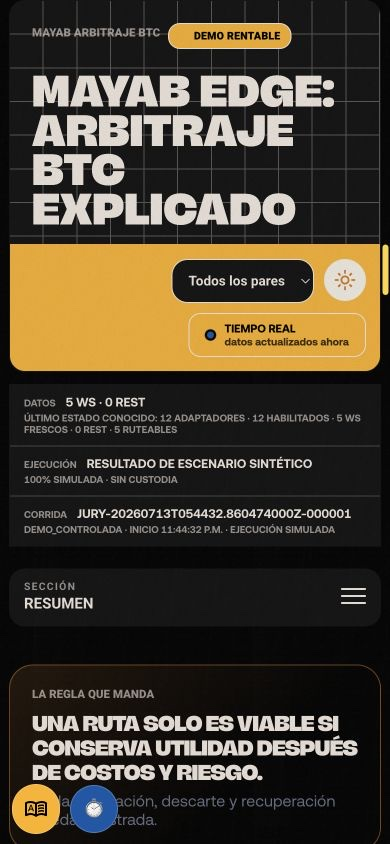
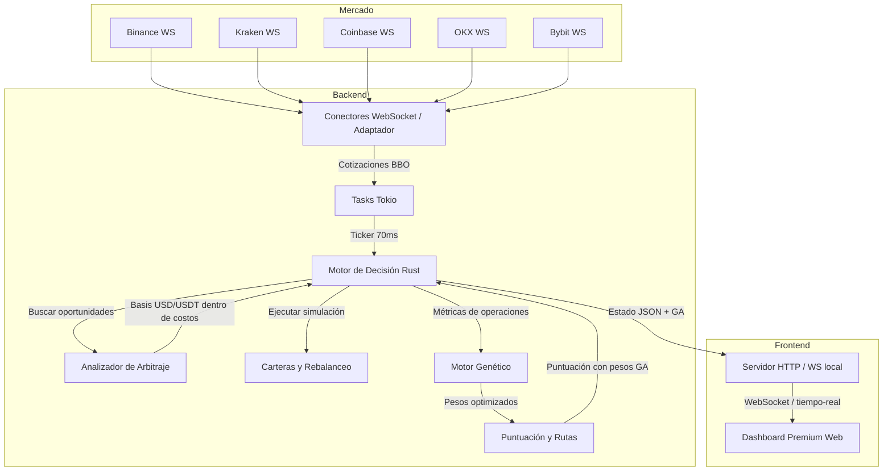

# Mayab Edge — arbitraje BTC explicable en Rust

Feeds públicos multi-exchange, decisiones auditables y ejecución 100% simulada en un solo binario Rust. El mismo proyecto también es mi [bot de Discord](#bot-de-discord-opcional): permite consultar el estado, pedir resúmenes y preparar demos reproducibles mediante slash commands.

> **Rust en el camino crítico; vanilla JS en la última milla: sin GC en el motor, sin hidratación en el dashboard y sin una cadena de servicios entre la señal y la evidencia.**

Esta es una decisión arquitectónica, no un benchmark inventado: Rust elimina el
GC del proceso y permite trabajo CPU multihilo; la UI nativa evita el runtime y
la hidratación de un framework. Node.js, Python y otros stacks pueden ser rápidos,
pero cualquier multiplicador requiere una implementación equivalente y el mismo
hardware/dataset. La metodología y sus límites están en
[ADR 3](docs/ADRs/0003-benchmark-rust-vs-node-php.md).

## Evidencia que cabe en una pantalla

| Señal verificable | Evidencia |
|---|---|
| 10 CEX públicos | WebSocket-first, con fallback REST etiquetado |
| Suite Rust multi-capa | conteo y resultado del CI del SHA entregable |
| 24 semillas pareadas | baseline y campeón GA sobre el mismo holdout |
| 10,000 remuestras bootstrap | IC temporal, efecto y corrección Holm |
| 0 BTC residual tras fallar la venta | `POST /api/demo/caos` termina en `RECONCILED` con ledger y reservas conciliadas |
| p50 / p95 / p99 del pipeline | valores runtime en `GET /api/latencias` y `GET /api/jurado` |

La cifra operacional principal no es un spread bruto: es **cero exposición residual después de una segunda pierna rechazada**, con la transición completa y su pérdida de unwind auditadas. Las cifras runtime se publican desde el proceso evaluado; no se congelan en marketing.

[Aplicación pública en Cloud Run](https://mayab-btc-arbitrage-3erllnacaa-uc.a.run.app)

[](https://github.com/raulivan1200/mayab-btc-arbitrage/actions/workflows/rust.yml)
[](https://github.com/raulivan1200/mayab-btc-arbitrage/actions/workflows/security.yml)
[](https://github.com/raulivan1200/mayab-btc-arbitrage/actions/workflows/coverage.yml)
[](https://github.com/raulivan1200/mayab-btc-arbitrage/actions/workflows/release.yml)


## Demo

Abre la [aplicación pública](https://mayab-btc-arbitrage-3erllnacaa-uc.a.run.app), la [consola operativa](https://mayab-btc-arbitrage-3erllnacaa-uc.a.run.app/operator) o la evidencia JSON en [`/api/paquete-evaluacion`](https://mayab-btc-arbitrage-3erllnacaa-uc.a.run.app/api/paquete-evaluacion). La demo rentable es sintética, repetible y queda etiquetada; nunca representa una orden real.


## Quick start (3–5 minutos)

Requiere una toolchain estable de Rust.

```bash
cargo run
```

En otra terminal:

```bash
curl -fsS http://127.0.0.1:8080/healthz
curl -fsS -X POST http://127.0.0.1:8080/api/demo \
  -H 'Content-Type: application/json' \
  -d '{"escenario":"mercado_rentable"}'
curl -fsS http://127.0.0.1:8080/api/estado
```

Visita `http://127.0.0.1:8080/` o `/operator`. Para el recorrido reproducible completo ejecuta `./scripts/smoke-demo.sh`.

## Guía del proyecto

El resto del README explica, en orden, el problema y la evidencia, arquitectura, modelo de rentabilidad neta, exchanges/símbolos, wallets/riesgo, benchmarks, observabilidad, seguridad, operación local, Docker/Cloud Run, configuración, endpoints, pruebas, extensión de exchanges, roadmap, contribución y el apéndice para jurado. Documentos de referencia: [arquitectura](docs/ARCHITECTURE.md), [seguridad](docs/SECURITY_MODEL.md), [operaciones](docs/OPERATIONS.md), [MCP-lite y Discord](docs/MCP_DISCORD.md), [añadir exchange](docs/ADDING_EXCHANGE.md) y [decisiones](docs/DESIGN_DECISIONS.md).

| Feature | Estado | Dónde se prueba | Evidencia |
|---|---|---|---|
| Arbitraje y Ejecución Simulada | Completado | `POST /api/demo/final` | Inspector de decisiones y auditoría SQLite |
| Riesgo y Escenarios Adversos | Completado | `POST /api/demo/caos` | Bitácora de eventos y circuit breaker |
| Gestión de Wallets y Rebalanceo | Completado | Dashboard > "Forzar rebalanceo" | Movimiento interno auditado con costo |
| Optimización Genética Híbrida | Completado | Dashboard > Panel GA | Visualización de pesos, convergencia y fitness |
| Evaluación y Backtest | Completado | `GET /api/paquete-evaluacion` | Scorecard, benchmark de latencia y exportaciones |

Mayab Arbitraje BTC concentra tres capacidades: **hot path event-driven en Rust con matemática decimal**, **decisión net-first con profundidad, inventario y riesgo de ejecución**, y **evidencia reproducible mediante replay, caos, auditoría y comparación contra baseline**. Monitorea libros públicos en 10 CEX, detecta rutas cross-exchange y triangulares y simula cada ejecución con costos explícitos. El GA multiobjetivo profundiza la selección de parámetros; no sustituye la contabilidad ni las reglas de riesgo.

Para contrastar revisiones de versiones anteriores con el entregable actual, consulta la [respuesta verificable a la auditoría](docs/RESPUESTA_AUDITORIA.md).
La comparación externa con los rivales públicos y las brechas P0/P1/P2 está en la [auditoría competitiva con corte 2026-07-12](docs/COMPETITOR_AUDIT_2026-07-12.md).

El sistema corre como un solo binario Rust: conexiones WebSocket concurrentes sobre Tokio, motor de decisión, simulador de carteras, optimización genética ligera, API Axum e interfaz web servida por el mismo proceso. Esa arquitectura reduce latencia operativa, simplifica el despliegue y permite demostrar el sistema en vivo sin una cadena pesada de servicios.

## Jurado en 60 segundos

1. Abre la [aplicación pública](https://mayab-btc-arbitrage-3erllnacaa-uc.a.run.app) y revisa el badge LIVE/DEMO/REST, P&L, mapa de rutas, wallets, eventos y panel GA. Si prefieres una visita guiada, pulsa **Recorrido de 2 min** en el encabezado; es opcional.
2. Abre `/api/jurado`: concentra rúbrica, scorecard, cobertura finalista, checks, evidencia clave y links de auditoría.
3. Abre `/api/preflight`: confirma `judgeReadiness.status=ready`, checks completos y la rúbrica oficial de 5 criterios.
4. La instancia pública queda precargada automáticamente al arrancar en `MAYAB_JUDGE_MODE=true` con una corrida auditada completa: GA, PnL positivo, fill parcial, mercado movido, liquidez insuficiente, segunda pierna rechazada con unwind a exposición cero y rebalanceo. El jurado puede reiniciar y repetir únicamente los recorridos cerrados `/api/demo/reset`, `/api/demo/final` y `/api/demo/caos`; cualquier otra mutación sigue protegida por `ADMIN_TOKEN`.
5. En local, o como operador autenticado, pulsa **Preparar demo auditada** y **Forzar rebalanceo** para reproducir la corrida y el movimiento interno con costo explícito.
6. Abre `/api/paquete-evaluacion`: verás scorecard, huella de auditoría, recomendaciones finales, backtest reproducible, evidencia SQLite y diferenciadores listos para revisión.

Validación automática equivalente:

```bash
./scripts/smoke-demo.sh
BASE_URL=https://tu-url-publica ADMIN_TOKEN="$ADMIN_TOKEN" ./scripts/smoke-demo.sh
```

Lo importante: el proyecto no intenta impresionar con spreads brutos. Cada ruta pasa por costos, profundidad, inventario, latencia, riesgo, auditoría y estrategia GA; si el mercado real está plano, la demo rentable queda marcada como sintética para probar el flujo sin fingir profit live.

## Alcance seguro del MVP

Este proyecto está diseñado como MVP demostrable y seguro para evaluación técnica:

- No guarda llaves API de exchanges.
- No firma órdenes reales.
- No custodia fondos.
- No hace depósitos, retiros ni transferencias on-chain.
- No puede cobrar comisiones reales: las comisiones, retiros, slippage y balances son parámetros de simulación.
- Los WebSockets de mercado consumen datos públicos.
- Los endpoints POST modifican únicamente el estado simulado del proceso y los parámetros visibles del dashboard.
- En producción (`MAYAB_ENV=production`), `ADMIN_TOKEN` es obligatorio, debe tener al menos 32 caracteres y protege los endpoints mutables mediante `Authorization: Bearer <token>` o `X-Admin-Token`. La excepción opt-in `MAYAB_JUDGE_MODE=true` sólo abre los tres recorridos de demo predefinidos; no abre configuración, wallets arbitrarios, exchanges, GA libre ni MCP.

Una demo local en modo desarrollo puede ejecutarse sin `ADMIN_TOKEN`; un deploy productivo falla de forma cerrada si no se configura. Si se quisiera convertir en producto con dinero real, la primera tarea no sería conectar órdenes, sino endurecer autenticación/autorización, rate limiting, auditoría, aislamiento de secretos, permisos por exchange y límites duros de exposición.

La ruta de madurez operacional se documenta como gates verificables en [LIVE_READINESS.md](LIVE_READINESS.md). El challenge público permanece en S0/S1 (simulación y replay offline); testnet sería evidencia adicional separada y no implica que el dashboard público opere fondos.

## Cumplimiento, privacidad y crecimiento futuro

El sistema está delimitado como demo técnica: no recibe depósitos, no custodia activos virtuales, no ejecuta órdenes por cuenta de clientes y no promete rendimientos. Esa separación es intencional para no cruzar el límite hacia un servicio financiero regulado.

Si el proyecto creciera hacia trading real, custodia, asesoría, ejecución para terceros o manejo de fondos, el roadmap debe abrir una fase regulatoria antes de escribir conectores privados: revisión bajo el marco fintech mexicano, autorización aplicable ante autoridades financieras, controles KYC/AML, administración de riesgos, bitácora auditable, segregación de secretos, autorización por operación y disclosures claros sobre volatilidad, irreversibilidad y riesgos tecnológicos de activos virtuales.

Privacidad del dashboard:

- No usa cookies.
- No genera identificadores persistentes de visitante.
- No envía datos personales al backend.
- `localStorage` solo se usa para tema visual, modo debug local, coordinación local de auto-GA entre pestañas y, opcionalmente, un `mayabAdminToken` que el operador puede definir manualmente en despliegues protegidos.
- El modo debug solo se activa con `?debug=1` o `localStorage.mayabDebug=1`.

Contrato HTTP:

- Los endpoints de lectura devuelven JSON estable.
- Los endpoints mutables devuelven `{"ok":true}` en éxito.
- Los errores de endpoints mutables usan `{"ok":false,"error":{"code":"...","message":"..."}}`, para que UI, scripts y pruebas puedan reaccionar sin parsear texto libre.
- El servidor emite headers básicos de hardening: `X-Content-Type-Options`, `X-Frame-Options`, `Referrer-Policy`, `Permissions-Policy` y `Content-Security-Policy`.

## Virtudes principales

La revision rapida y reproducible esta en [docs/EVIDENCE_MATRIX.md](docs/EVIDENCE_MATRIX.md). Separa evidencia LIVE de escenarios SYNTHETIC y enlaza cada afirmacion con runtime, codigo, prueba y endpoint.

- **GA híbrido multiobjetivo**: non-dominated sorting, rank y crowding distance sobre PnL, Sharpe, drawdown y win rate; publica el frente de Pareto y elige de forma determinista el mayor fitness ajustado por riesgo del primer frente. Incluye cruce uniforme, mutación gaussiana, **recocido simulado**, **evolución diferencial** y **reinicio adaptativo**.
- **Scoring adaptativo**: Los pesos de la función de puntuación (utilidad, frescura, liquidez, confiabilidad, Z-Score) son optimizados genéticamente, no fijos.
- **Metaheurísticas híbridas**: Combina GA clásico con recocido simulado, evolución diferencial y reinicio por convergencia para escapar de óptimos locales.
- **Detección de convergencia y reinicio adaptativo**: Cuando el fitness deja de mejorar, se inyecta diversidad y se aumenta la tasa de mutación.
- **Diez adaptadores CEX implementados**: Binance, Kraken, Coinbase, OKX, Bybit, Bitfinex, KuCoin, Gate.io, Bitstamp y Gemini. El dashboard distingue adaptador disponible, venue habilitado, feed conectado y libro ruteable; nunca presenta feeds o pares como si fueran exchanges únicos.
- **Arbitraje Triangular**: Detección y simulación en ciclos de tres monedas.
- **Métricas Fintech Avanzadas**: Sharpe Ratio, Sortino Ratio, Kelly Criterion, TOBI, y actualización Bayesiana.
- **Soporte Multi-Par Automático**: Permite añadir pares dinámicos (e.g. ETH, SOL) a través de PARES_EXTRA.
- **WebSocket-first con REST fallback público**: los WebSockets son la fuente primaria; si un feed queda stale o desconectado, el adaptador toma un snapshot REST de order book y lo marca como `rest_fallback`.
- **Integridad observable por feed**: `/metrics` publica conexión, latencia, tiempo invalidado, resincronizaciones, gaps de secuencia y fallos de checksum por exchange/par. Así una desconexión o libro corrupto deja evidencia cuantificable en vez de convertirse silenciosamente en una oportunidad.
- **Evaluación de rutas compra-venta en cada ciclo**, no solo comparación entre dos mercados fijos.
- **Precisión financiera interna con `rust_decimal`**: fees, slippage, retiro amortizado, basis USD/USDT, PnL, tamaño ejecutable y actualización de wallets se calculan con decimal fijo; el JSON público conserva números para compatibilidad con la UI.
- **Simulación realista** con comisiones por casa, deslizamiento estimado con niveles de order book, retiro amortizado, riesgo de latencia, balances por cartera y ajuste USD/USDT.
- **Separación USD/USDT por defecto**: el motor no trata BTC/USD y BTC/USDT como la misma lane para evitar spreads falsos por basis; el cruce solo se habilita explícitamente.
- **Liquidez acumulada de profundidad**: el tamaño ejecutable usa hasta 10 niveles del libro, no solo el mejor bid/ask.
- **Revalidación pre-ejecución**: antes de mover balances simulados, la ruta se recalcula con el snapshot más fresco y se rechaza si el spread se deterioró.
- **Single-trade-in-flight**: solo una operación simulada puede estar en validación/ejecución a la vez, evitando doble gasto de balances bajo ticks rápidos.
- **Órdenes parciales** cuando la liquidez acumulada o el balance no cubren el tamaño objetivo.
- **Escenarios adversos simulables**: rechazo de orden, mercado movido entre detección y ejecución, fills parciales, saldos insuficientes y trazabilidad de cada evento.
- **Circuit Breaker y Modo Conservador** por volatilidad: se duplica el umbral mínimo de spread cuando el mercado es volátil.
- **Z-Score con ventana histórica** de 100 muestras: scoring estadístico de cada ruta.
- **Rebalanceo inteligente de carteras simuladas** cada 100 ciclos con movimientos internos USD/BTC, umbrales configurables y bitácora de movimientos.
- **Backtest reproducible multisemilla** vía API/UI: compara baseline contra el campeón GA publicado en 24 semillas comunes y muestra mediana y P05–P95.
- **Bootstrap temporal pareado**: 10,000 remuestras moving-block con seed explícita, sensibilidad de bloques de 30/60/120 s, IC percentiles de PnL neto, fill rate, drawdown y sus diferencias; incluye P(ΔPnL > 0), permutación por bloques, tamaño del efecto, corrección Holm y conclusión inconclusa si el IC de ΔPnL cruza cero.
- **Preflight operacional** (`/api/preflight`) con salud de feeds, configuración, riesgo, GA, archivos del dashboard y endpoints de auditoría.
- **Jury Mode** (`/api/jurado`) como superficie única de evaluación: matriz de evidencia PASS/WARN/FAIL, cobertura contra la rúbrica, checks, timestamps y enlaces verificables. Mayab no se asigna una calificación a sí mismo.
- **Endpoint compatible con LLMs y revisores automáticos** (`/api/resumen-llm`) con resumen narrativo, Markdown y métricas clave sin tener que interpretar HTML.
- **Paquete de evaluación para jurado** (`/api/paquete-evaluacion`) con matriz de evidencia, guion de demo, backtest reproducible y huella de corrida.
- **Tablero operativo en tiempo real** con mapa de rutas, panel forense de oportunidades, score EV, modo LIVE/DEMO/REST, timeline operativo, presets de estrategia, panel genético (fitness, diversidad, pesos, convergencia), ganancia/pérdida, latencia, oportunidades y ejecuciones.
- **Auditoría de decisiones** por ruta: score final, razón de aceptación/descarte, pesos GA usados, costo total, latencia, Z-Score y balances relevantes antes de ejecutar.
- **Auditoría local en SQLite**: operaciones, oportunidades, eventos, rebalanceos y decisiones se guardan para revisión y exportación. En Cloud Run, `/tmp` es efímero; retención permanente requiere volumen o backend externo.
- **Ranking de latencia por exchange** con EWMA, min/max, feed degradado y sugerencia de región operativa.
- **Telemetría end-to-end del pipeline**: separa wire latency de quote→decisión y compute interno, publica p50/p95/p99, throughput, rutas evaluadas y ticks coalescidos sin datos nuevos.
- **Modo demo adverso controlado** desde la UI/API para forzar fallo de orden, shock de mercado, liquidez insuficiente, circuit breaker y rebalanceo sin depender del azar.
- **Prueba de caos encadenada** (`POST /api/demo/caos`): ejecuta fill parcial, baja liquidez, rechazo de segunda pierna con unwind, circuit breaker, rebalanceo y recuperación; termina con ocho checks y exposición residual explícita.
- **Modo demo rentable + GA** para inyectar operaciones sintéticas auditables, generar P&L visible y entrenar el GA cuando el mercado real no ofrece spread neto ejecutable.
- **Exportación JSON/CSV** de operaciones, oportunidades, eventos, auditoría, rebalanceos, balances, configuración y estado GA.
- Docker listo para correr sin instalar Rust en la máquina evaluadora.

## Capturas




## Qué hace

- Conecta feeds públicos WebSocket de Binance, Kraken, Coinbase, OKX, Bybit, Bitfinex, KuCoin, Gate.io, Bitstamp y Gemini.
- Usa REST fallback de market data público para rellenar snapshots cuando el WebSocket de un exchange no está fresco.
- Normaliza compra, venta, cantidad disponible, marca de tiempo y latencia por casa.
- Evalúa todas las rutas compra-venta posibles entre casas de cambio.
- Mantiene lanes USD y USDT separadas por defecto para no imprimir oportunidades falsas por diferencias de stablecoin/fiat.
- Calcula rentabilidad bruta y neta considerando comisiones, deslizamiento, retiro amortizado y riesgo de latencia.
- Usa `rust_decimal` en la aritmética crítica del motor; los contratos HTTP siguen exponiendo `number` para mantener simple el dashboard y los exports.
- Explica cada oportunidad con desglose de spread bruto/neto, tamaño, utilidad esperada, latencia, Z-Score y stack de costos.
- **Ejecuta el Algoritmo Genético cada 500 ciclos**: actualiza pesos de scoring con las métricas recolectadas de operaciones simuladas.
- **Pondera oportunidades con pesos evolucionados**: la función de scoring usa los pesos, umbral, tamaño máximo y tolerancia a latencia del mejor individuo de la generación actual.
- Simula ejecuciones parciales cuando no hay liquidez o balance suficiente.
- Serializa la ejecución simulada con un candado atómico para que las carteras no puedan ser consumidas por dos rutas al mismo tiempo.
- Registra eventos de robustez: orden simulada ejecutada, rechazo simulado, mercado movido y fallo por saldo.
- Mantiene carteras por casa y ganancia/pérdida acumulada.
- Rebalancea wallets simuladas cuando USD o BTC caen debajo del objetivo operativo configurado.
- **Permite activar/desactivar exchanges individualmente** desde la UI en tiempo real.
- Permite cambiar el perfil operativo con presets: Balanceado, Agresivo, Seguro y Estrés.
- Expone un tablero web en tiempo real con mapa de rutas, score por oportunidad, panel genético, tablas, balances, rebalanceos, timeline operativo, modo demo/live/rest, backtest y gráficas.
- Expone `/api/preflight` como gate 12/12 de operación, evidencia, conciliación y persistencia.
- Expone un snapshot compacto para agentes y scripts en `/api/resumen-llm`, incluyendo decisión actual, mejor ruta, GA, riesgo, PnL y últimos eventos.
- Expone `/api/paquete-evaluacion` como evidencia autocontenida para jueces: score por criterio, guion de demo, resumen ejecutivo, backtest y enlaces de auditoría.
- Persiste evidencia en SQLite para desarrollo local y en TimescaleDB durable para producción.

## Tecnologías utilizadas

- Rust 2021
- Tokio para runtime asíncrono y tareas concurrentes
- Axum para API HTTP y WebSocket del dashboard
- tokio-tungstenite para conexiones WebSocket con exchanges
- rust_decimal para aritmética financiera interna
- SQLite/rusqlite para auditoría durable local
- PostgreSQL/TimescaleDB con TLS para auditoría durable de producción
- Serde/serde_json para normalización de payloads y contratos JSON
- HTML, CSS y JavaScript sin framework ni paso de compilación
- Canvas 2D para gráficas y mapa de arbitraje
- Docker y Docker Compose para ejecución reproducible

## Arquitectura

El sistema está diseñado bajo una arquitectura modular y concurrente en Rust:



Estructura de archivos:
```text
Cargo.toml                     workspace virtual (miembros y perfiles)
mayab-arbitrage/               crate de biblioteca (toda la lógica y tests)
mayab-cli/                     crate binario que ensambla y arranca el proceso
internal/webui/web             interfaz web estática servida por el binario Rust
```

El crate `mayab-arbitrage` contiene `config`, `mercado` (con el trait
`ExchangeAdapter`), `motor`, `ga`, `auditoria` (trait de persistencia),
`persistencia` (SQLite), `persistencia_timescale` (TimescaleDB, feature
`timescaledb`) y `metricas` (Prometheus), además de
`server`. El mapa de mantenimiento completo está en
[ARCHITECTURE.md](ARCHITECTURE.md).

Mapa de mantenimiento con responsabilidades por archivo: [ARCHITECTURE.md](ARCHITECTURE.md).

El servidor mantiene una tarea Tokio por cada feed de mercado WebSocket y un ciclo de análisis periódico independiente. La interfaz web recibe actualizaciones en tiempo real mediante una conexión WebSocket única en `/tiempo-real` y puede modificar parámetros en caliente consumiendo las APIs `/api/config`, `/api/exchanges`, `/api/ga/config` vía POST.

## Demo para el comité

### Respuesta a “¿qué pasa si compra y la venta falla?”

El motor no presenta ese caso como un simple circuit breaker. La demo publica una máquina de estados auditable:

```text
DETECTED → RESERVED
→ LEG1_SUBMITTED → LEG1_FILLED
→ LEG2_SUBMITTED → LEG2_REJECTED
→ RECOVERY_SELECTED
→ RECONCILED
```

La exposición temporal aparece en la traza, el unwind registra su PnL realizado y la conciliación exige `exposicionFinalBtc = 0`. Se reproduce con `POST /api/demo/caos`, se ve en la tabla **FSM de ejecución y conciliación** y forma parte del gate de release.

Flujo recomendado para evaluar la aplicación en vivo:

1. Abrir el dashboard y observar el mapa de rutas, P&L, latencia, oportunidades y carteras.
2. Seleccionar una oportunidad en la tabla para ver el panel forense: bruto vs neto, costos, liquidez, latencia, Z-Score y razón de aceptación o rechazo.
3. Probar presets de estrategia:
   - **Balanceado**: perfil por defecto para mercado normal.
   - **Agresivo**: menor umbral, mayor tamaño y menor cooldown.
   - **Seguro**: mayor exigencia neta, menor tamaño, más castigo por latencia.
   - **Estrés**: aumenta probabilidad de fallo, movimiento brusco y activa una gestión más conservadora.
4. Desactivar un exchange y confirmar que el motor recalcula rutas y mantiene el estado activo/inactivo visible.
5. Usar “Demo controlada” para forzar fallo de orden, shock de mercado, fill parcial, liquidez insuficiente, circuit breaker o rebalanceo; confirmar que aparecen en operaciones, eventos y auditoría.
6. Si el mercado real está plano, pulsa **Preparar recorrido completo**. La acción explícita reinicia la corrida simulada y confirma operaciones, P&L, oportunidades verdes, fill parcial, rebalanceo, auditoría y GA activo. **Repetir escenario rentable** inyecta sólo otra dislocación rentable dentro de la corrida actual.
7. Exportar JSON/CSV para revisar trazabilidad fuera del dashboard.
8. Ejecutar el backtest reproducible para comparar estrategia base vs estrategia optimizada con los costos vigentes.
9. Forzar una evolución genética y observar fuente de entrenamiento, muestras, fitness, diversidad y pesos de scoring.

Guion detallado para revisión o videollamada: [docs/defensa-comite.md](docs/defensa-comite.md).

## Judge checklist

- Real-time order book monitoring: sí, WebSocket-first en **10 CEX públicos** con REST fallback; los 2 adaptadores DEX adicionales son experimentales y simulados, no feeds públicos reales.
- Net profitability calculation: sí, spread bruto/neto con fees, slippage, retiro amortizado y haircut de latencia.
- Partial fills: sí, el tamaño ejecutable se limita por profundidad acumulada, USD disponible y BTC prefundeado.
- Wallet accounting: sí, balances simulados por exchange, rebalanceos internos y eventos auditables.
- Decision inspector: sí, `decisionCode`, `decisionReason`, umbral, valor actual, score, pesos GA y breakdown de costos.
- Risk guards: sí, stale-book guard, circuit breaker, modo conservador, revalidación pre-ejecución y single-trade-in-flight.
- Web dashboard: sí, UI en tiempo real con rutas, PnL, wallets, latencias, GA, eventos y auditoría.
- Public deployment: sí, Cloud Run como ruta principal.
- Tests: sí, `cargo fmt -- --check` y `cargo test`; recomendado correr `cargo clippy -- -D warnings` antes de release.

## Qué no hace

- No coloca órdenes reales.
- No requiere llaves API privadas.
- No custodia fondos ni mueve activos on-chain.
- No finge profit live: el modo rentable es sintético, controlado y etiquetado como demo.

## Ejecución rápida con Docker

Solo necesitas Docker:

```bash
./scripts/run.sh
```

O directamente:

```bash
docker-compose up --build
```

Abre:

```text
http://localhost:8080
```

## Ejecución local con Rust

Requisitos: Rust estable compatible con `Cargo.lock` y acceso de red a los
feeds públicos. Node.js solo es necesario para el gate visual de `make check`.

```bash
cargo fetch --locked
cargo run
```

`cargo run` levanta el servidor en `http://localhost:8080` y abre el dashboard
automáticamente en el navegador. Para arrancarlo sin abrir una ventana (por
ejemplo, desde una terminal remota), usa `MAYAB_OPEN_BROWSER=0 cargo run`.

Comprueba que el backend y los feeds estén disponibles:

```bash
curl -sS http://127.0.0.1:8080/healthz
curl -sS http://127.0.0.1:8080/api/preflight
curl -sS http://127.0.0.1:8080/api/estado
```

Modo debug local:

```bash
RUST_LOG=debug cargo run
```

En el dashboard, agrega `?debug=1` a la URL o define `localStorage.mayabDebug = "1"` para activar métricas y logs de navegador. Sin ese flag no se emiten `console.*`, no se instalan observers de performance y el dashboard mantiene la ruta ligera de producción.

En builds release el filtro por defecto baja a `error`; usa `RUST_LOG=info` o `RUST_LOG=debug` solo durante diagnóstico.

Pruebas:

```bash
cargo test
make check
```

Con el servidor activo, el smoke de demo valida salud, preflight, GA, demo rentable, rebalanceo, paquete de evaluación, resumen LLM, PnL positivo, rúbrica oficial completa y recomendación final lista:

```bash
make smoke
BASE_URL=https://tu-url-publica ./scripts/smoke-demo.sh
```

Para simular la entrega completa sin depender de un servidor ya levantado:

```bash
make release-check
```

Compilación:

```bash
cargo build --release
```

## Configuración

### Salud, readiness y límites HTTP

`GET /healthz` confirma que el proceso responde. `GET /readyz` devuelve 200
cuando SQLite está activo, el motor tiene cotizaciones, existen al menos dos feeds
frescos y no hay circuit breaker, riesgo crítico ni ejecución en curso; si no,
devuelve 503 con un arreglo `checks` explicativo.

Límites configurables: `HTTP_MAX_BODY_BYTES` (1 MiB), `HTTP_TIMEOUT_SECS` (30 s),
`HTTP_MAX_CONCURRENCY` (128), `HTTP_READ_RPM` (300) y `HTTP_MUTATION_RPM` (30).
API, métricas y WebSocket usan `Cache-Control: no-store`; HTML revalida y los
assets estáticos se cachean una hora.

E2E del dashboard:

```bash
npm install
npx playwright install chromium
npm run test:e2e
```

Puedes ajustar el perfil de costos y parámetros del algoritmo genético con variables de entorno:

```bash
# Parámetros de trading
ENABLED_EXCHANGES=Binance,Kraken,Coinbase,OKX \
SYMBOLS=BTC/USD,BTC/USDT,ETH/USD \
PERSISTENCE_QUEUE_CAPACITY=2048 \
MAX_OPERACION_BTC=0.18 \
MIN_UTILIDAD_USD=1.25 \
MIN_DIFERENCIAL_NETO_BPS=0.65 \
DESLIZAMIENTO_BPS=0.35 \
ENFRIAMIENTO_MS=1400 \
RETIRO_AMORTIZADO_BPS=0.12 \
LATENCIA_RIESGO_BPS=0.08 \
STALE_MS=4500 \
USDT_USD_PREMIUM_BPS=3.0 \
PERMITIR_CRUCE_USD_USDT=false \
CIRCUIT_BREAKER_PERDIDA_USD=500.0 \
CIRCUIT_BREAKER_VENTANA_MIN=10 \
VOLATILIDAD_UMBRAL_BPS=50.0 \
VOLATILIDAD_VENTANA_SEG=30 \
SIMULAR_ADVERSIDAD=true \
PROB_FALLO_ORDEN=0.015 \
PROB_MOVIMIENTO_BRUSCO=0.020 \
MOVIMIENTO_BRUSCO_BPS=7.0 \
REBALANCE_UMBRAL_PCT=35.0 \
REBALANCE_MAX_TRANSFER_PCT=35.0 \
PORT=8080 \
ADMIN_TOKEN=obligatorio_en_produccion_minimo_32_caracteres \
AUDITORIA_DB_PATH=/data/mayab-auditoria.sqlite \
STORAGE_MODE=sqlite_ephemeral \
CAPITAL_INICIAL_USD=250000.0 \
BALANCE_INICIAL_BTC=1.25 \
cargo run
```

`AUDITORIA_DB_PATH` apunta a SQLite local. `STORAGE_MODE=sqlite_ephemeral` es el valor seguro por defecto y no promete retención entre instancias. Usa `STORAGE_MODE=sqlite_persistent` solamente cuando `/data` esté respaldado por un volumen durable; la API expone `storageMode`, `storageStatus` y `storagePersistent`.

Para producción, `STORAGE_MODE=timescaledb` selecciona el backend PostgreSQL/
TimescaleDB sin fallback silencioso. Requiere compilar el feature `timescaledb`,
una `DATABASE_URL` con `sslmode=require` (salvo redes privadas configuradas
explícitamente con `sslmode=disable`) y el esquema versionado:

```bash
psql "$DATABASE_URL" -f scripts/timescaledb/schema.sql
cargo run -p mayab-cli --bin mayab-arbitrage --features timescaledb
```

La URL nunca se publica: estado y logs muestran `timescaledb://[redacted]`.

`ENABLED_EXCHANGES` y `SYMBOLS` son listas separadas por comas. La persistencia
usa un worker con cola acotada; `queueCapacity`, `queuePending` y `queueDropped`
permiten observar backpressure sin meter SQLite en el hot path.

Comisiones por casa de cambio:

```bash
FEE_BINANCE=0.001
FEE_KRAKEN=0.0026
FEE_COINBASE=0.006
FEE_OKX=0.001
FEE_BYBIT=0.001
RETIRO_BTC_BINANCE=0.00010
RETIRO_BTC_KRAKEN=0.00020
RETIRO_BTC_COINBASE=0.00012
RETIRO_BTC_OKX=0.00010
RETIRO_BTC_BYBIT=0.00010
```

## Despliegue

La demo pública actual apunta a Cloud Run. Es la opción recomendada para el comité porque soporta WebSockets, HTTPS automático, logs centralizados y despliegue directo desde el repo.

Deploy manual desde el código fuente. El script deja una sola instancia
caliente porque wallets, GA y WebSocket viven en el proceso; la auditoría queda
en TimescaleDB durable. Antes, crea dos secretos en Secret Manager: el token de
administración y la `DATABASE_URL` cuyo esquema ya fue inicializado.

```bash
PROJECT=arahli-495117 \
REGION=us-central1 \
MIN_INSTANCES=1 \
MAX_INSTANCES=1 \
ADMIN_TOKEN_SECRET=mayab-admin-token:latest \
DATABASE_URL_SECRET=mayab-database-url:latest \
./scripts/deploy-cloud-run.sh
```

Variables útiles para la demo final:

```bash
# Si quieres mover región, cambia REGION y actualiza la URL pública entregada.
REGION=us-east4 ./scripts/deploy-cloud-run.sh

# También acepta una imagen ya publicada y evita Cloud Build.
IMAGE=us-central1-docker.pkg.dev/PROYECTO/REPO/IMAGEN:SHA \
./scripts/deploy-cloud-run.sh
```

Después del deploy:

```bash
BASE_URL=https://tu-url-publica ./scripts/smoke-demo.sh
curl -sS https://tu-url-publica/api/preflight
```

### CI/CD automático

El workflow `.github/workflows/rust.yml` ejecuta formato, Clippy, tests, build
release y smoke local en cada push o pull request. En un push verde a `master`,
además:

1. autentica GitHub en Google Cloud mediante OIDC/Workload Identity Federation;
2. construye una imagen etiquetada con el SHA completo del commit;
3. la publica en Artifact Registry;
4. despliega Cloud Run con `min=1` y `max=1`;
5. ejecuta el smoke público y deja preparada la demo del jurado.

No se guarda una llave JSON. El repositorio usa estas GitHub Actions Variables:

```text
GCP_PROJECT_ID
GCP_REGION
CLOUD_RUN_SERVICE
GAR_REPOSITORY
WIF_PROVIDER
WIF_SERVICE_ACCOUNT
```

Los pull requests nunca despliegan. La identidad federada está condicionada al
repositorio y a `refs/heads/master`. Para revisar el último rollout:

```bash
gh run list --workflow rust.yml --limit 5
gcloud run revisions list --service mayab-btc-arbitrage --region us-central1
```

### Benchmark real multi-región

`scripts/benchmark-cloud-run-regions.sh` despliega temporalmente el mismo digest
del contenedor en varias regiones de Cloud Run, calienta los feeds públicos y
compara la latencia *evento del exchange → ingestión regional* usando p50, p95 y
p99 de `/api/latencias`. También registra el RTT HTTP desde la máquina que corre
el script hasta el endpoint desplegado. 

**Nota sobre latencia y rendimiento:**
`telemetriaPipeline.compute*` conserva ese nombre por compatibilidad del contrato,
pero actualmente mide el ciclo completo de análisis: adquisición de locks,
construcción del snapshot, evaluación de rutas, auditoría y ejecución simulada
cuando aplica. No representa "cómputo puro" ni sostiene un SLA de `<500 µs`.
`quoteToDecision*` mide por separado la edad de la cotización más reciente al
cerrar el ciclo, y `/api/latencias` reporta el transporte observado por exchange.
Los percentiles deben citarse junto con la fecha, región, SHA y carga de la
corrida; el script registra además el RTT HTTP como métrica secundaria. Al
terminar elimina las réplicas por defecto
para no dejar costo o estado duplicado.

```bash
REGIONS="us-central1 us-east4 us-west1" \
WARMUP_SECONDS=45 \
SAMPLES=3 \
./scripts/benchmark-cloud-run-regions.sh
```

Los resultados quedan en JSON y CSV bajo `/tmp/mayab-region-benchmark-*`. Esto
es un benchmark reproducible de una corrida y sus condiciones de red, no una
promesa universal de latencia ni un SLA de los exchanges. Usa `CLEANUP=0` solo
si necesitas inspeccionar temporalmente las réplicas y elimínalas después.

Render también está soportado vía `render.yaml`, pero el plan gratuito puede dormir la app y hacer que la primera carga sea lenta.

Fly.io también está preparado con `fly.toml`, aunque requiere instalar `flyctl`:

```bash
fly launch --copy-config
fly deploy
```

## Endpoints

```text
GET  /                     tablero web embebido
GET  /healthz              verificación de salud para ejecución local
GET  /api/healthz          verificación de salud canónica para Cloud Run y monitores externos
GET  /api/version          build, schema, sesión y hashes canónicos de dataset/configuración
GET  /api/estado           captura JSON completa del estado (incluye estado genético)
GET  /api/jurado           Jury Mode: rúbrica, scorecard, cobertura, checks y enlaces de auditoría
GET  /api/preflight        gate 12/12: operación, evidencia, conciliación y persistencia
GET  /api/resumen-llm      snapshot compacto para jueces, scripts y agentes LLM
POST /api/discord/interactions webhook firmado para slash commands de Discord
GET  /api/mcp/manifest     catálogo MCP-lite de herramientas para agentes LLM
POST /api/mcp/call         invoca herramientas MCP-lite; mutaciones respetan ADMIN_TOKEN
GET  /api/paquete-evaluacion scorecard, evidencia y guion reproducible para jurado
GET  /api/latencias        wire latency + pipeline p50/p95/p99, throughput y coalescing
GET  /api/backtest         backtest reproducible con bootstrap temporal pareado e IC 95%
GET  /api/lab/sweep        Research Lab: sweep Conservador/Balanceado/Agresivo/GA Edge
GET  /api/research/economics waterfall, break-even, capacidad y embudo observados
GET  /api/research/execution-matrix matriz determinista de 12 escenarios de ejecución
GET  /api/export/json      descarga reporte completo de auditoría en JSON
GET  /api/export/csv       descarga bitácora unificada en CSV
POST /api/config           actualizar parámetros de simulación
POST /api/demo             disparar escenario adverso o demo rentable controlada
POST /api/demo/reset       reiniciar balances, PnL, riesgo y GA conservando feeds/configuración
POST /api/demo/caos        prueba encadenada de resiliencia con recuperación y checks finales
POST /api/demo/final       prepara demo final: GA, mercado rentable, fill parcial y rebalanceo
GET  /api/ga/estado        estado detallado del motor genético
GET  /api/ga/config        configuración actual del GA
POST /api/ga/config        actualizar configuración del GA (tamaño población, tasas, etc.)
POST /api/ga/evolucionar   forzar evolución manual; usa replay sintético si no hay trades reales
POST /api/exchanges        activar/desactivar un exchange en la simulación
WS   /tiempo-real          transmisión del estado en vivo cada 450 ms (~2.2 Hz)
```

### Bot de Discord (opcional)

El mismo binario puede atender Discord mediante Interactions HTTP, una opción
adecuada para Cloud Run porque no mantiene otro WebSocket abierto. Cada petición
se valida con Ed25519 antes de leerla. El bot publica `/estado`, `/resumen`,
`/demo-rentable`, `/mayab pregunta:<texto>` y `/ask pregunta:<texto>`; los dos
últimos usan NVIDIA NIM como agente con herramientas locales sobre la
simulación.

Perfil sugerido en Discord Developer Portal:

- **Name:** `Mayab Arbitraje BTC`
- **Description:** `Monitorea una demo segura de arbitraje BTC simulado: feeds públicos, PnL, riesgo y evolución genética. Consulta el estado desde Discord y prepara escenarios reproducibles; no ejecuta órdenes reales, no custodia fondos y no usa llaves de exchanges.`
- **Tags:** `bitcoin`, `analytics`, `simulation`, `finance`, `developer-tools`

Configura el entorno sin versionar el token:

```bash
cp .env.example .env
# Edita .env y reemplaza <YOUR_BOT_TOKEN> con el token de la página Bot.
cargo run
```

En **General Information → Interactions Endpoint URL**, usa la URL pública:

```text
https://TU_SERVICIO/api/discord/interactions
```

El `Application ID` y la `Public Key` entregados para esta app ya están en
`.env.example`; no son secretos. `DISCORD_BOT_TOKEN` sí es secreto: nunca debe
subirse al repositorio. Si defines `DISCORD_GUILD_ID`, los comandos se registran
en ese servidor para pruebas inmediatas; sin él, se registran globalmente. Para
instalar la app, habilita los scopes `applications.commands` y `bot`; estos
comandos no requieren permisos adicionales del bot.

La IA requiere una key nueva y privada en `NVIDIA_API_KEY`. El agente intenta
los modelos de `NVIDIA_MODELS` en orden y continúa con el siguiente ante errores,
timeouts o respuestas inválidas. Los defaults comprobados son Nemotron 3 Nano
Omni, Nemotron 3 Nano y Nemotron 3 Ultra. Sus herramientas son:

- `get_state`: métricas, riesgo, operaciones y GA.
- `get_config`: parámetros vigentes del motor.
- `get_audit_history`: resumen SQLite y últimas operaciones, en modo solo lectura.
- `prepare_demo`: escenario rentable estrictamente simulado.
- `update_parameters`: modifica límites simples validados; solo aparece para
  miembros con `Manage Server` o `Administrator`.

`prepare_demo` y `/demo-rentable` cambian únicamente el estado simulado y están
disponibles para cualquier usuario que pueda invocar los comandos instalados.
La configuración completa, el flujo de firma y los límites de autorización se
detallan en [MCP-lite y Discord](docs/MCP_DISCORD.md).

Discord recibe primero una respuesta diferida y el resultado de NVIDIA se
publica después, evitando exceder la ventana inicial de Interactions. Las keys
de NVIDIA o Discord deben configurarse con Secret Manager en Cloud Run, nunca
como argumentos, código fuente o variables incluidas en imágenes Docker.

### Modelo de seguridad de la demo

La ejecución de Fase 7 está aislada en un binario opt-in para Coinbase Exchange
Sandbox; no convierte este servidor público en un bot live. Su threat model,
configuración fail-closed, ciclo de órdenes, ledger y despliegue privado están en
[docs/TESTNET_EXECUTION.md](docs/TESTNET_EXECUTION.md).

Los endpoints GET de evidencia permanecen públicos. En desarrollo local los POST pueden usarse sin token. En producción, las mutaciones requieren `ADMIN_TOKEN`, salvo que el deploy active explícitamente `MAYAB_JUDGE_MODE=true`: en ese caso sólo `/api/demo/reset`, `/api/demo/final` y `/api/demo/caos` son públicos, deterministas, simulados y sujetos al rate limit HTTP. Esta superficie estrecha permite la evaluación sin exponer el panel administrativo.

El token se envía como `Authorization: Bearer <token>` o `X-Admin-Token`. No debe incluirse en capturas, URLs, código cliente versionado ni imágenes Docker. Una eventual versión con dinero real requeriría además autorización por acción, roles, límites de exposición y controles de secretos antes de conectar cualquier API privada.

### Ejemplo de activar/desactivar exchange

```bash
curl -X POST http://localhost:8080/api/exchanges \
  -H "Content-Type: application/json" \
  -H "Authorization: Bearer ${ADMIN_TOKEN}" \
  -d '{"exchange":"Coinbase","activo":false}'
```

### Ejemplo de resumen para LLM o revisión automática

```bash
curl http://localhost:8080/api/resumen-llm
```

El endpoint devuelve:

- `resumen`: lectura ejecutiva en español.
- `markdown`: resumen compacto listo para pegar en reportes.
- `decision`: acción operativa actual del motor.
- `metricasClave`: PnL, retorno, riesgo, drawdown, win rate, latencia, fallos y rebalanceos.
- `mejorRuta`: ruta con mayor diferencial neto y razón de ejecución o descarte.
- `ga`: generación, fitness, diversidad y parámetros optimizados.
- `mlEdge`: EV, confianza, survival probability, fill probability, adverse selection y contribuciones por feature.
- `persistencia`: backend efectivo, durabilidad, ruta redactada y conteos de operaciones, ejecuciones, oportunidades, eventos, auditorías y rebalanceos guardados.

### Bridge MCP-lite para agentes

MCP-lite es un contrato HTTP/JSON propio, no un servidor compatible de forma
directa con el transporte MCP estándar. Un cliente MCP estándar necesita un
adaptador; el manifiesto lo declara explícitamente.

```bash
curl http://localhost:8080/api/mcp/manifest

curl -X POST http://localhost:8080/api/mcp/call \
  -H 'Content-Type: application/json' \
  -d '{"tool":"summarize_for_llm"}'
```

El bridge expone herramientas de lectura (`get_state`, `preflight`, `jury_mode`, `summarize_for_llm`, `evaluation_package`, `latency_ranking`, `backtest`, `research_lab_sweep`) y herramientas mutables de demo (`prepare_demo_final`, `evolve_ga`, `demo_scenario`). En producción, las mutables requieren `Authorization: Bearer <token>` o `X-Admin-Token`; en desarrollo local el token es opcional. El catálogo, los argumentos y las respuestas están en [MCP-lite y Discord](docs/MCP_DISCORD.md).

### Ejemplo de paquete para jurado

```bash
curl http://localhost:8080/api/paquete-evaluacion
```

El endpoint devuelve un scorecard con criterios de demo segura, datos en tiempo real, motor ejecutable, scoring evolutivo explicable, GA, riesgo, auditoría SQLite local, Research Lab y backtest/export. También incluye `scriptDemo`, `evidencia`, `huellaAuditoria` y los endpoints que permiten reproducir la revisión.

Para convertir ese scorecard en una prueba repetible:

```bash
curl -X POST http://localhost:8080/api/demo/reset -H "Authorization: Bearer ${ADMIN_TOKEN}"
curl -X POST http://localhost:8080/api/demo/caos -H "Authorization: Bearer ${ADMIN_TOKEN}"
curl -X POST http://localhost:8080/api/demo/final -H "Authorization: Bearer ${ADMIN_TOKEN}"
curl http://localhost:8080/api/lab/sweep
curl http://localhost:8080/api/paquete-evaluacion
```

`/api/demo/reset` crea una corrida limpia sin tumbar los feeds públicos. `/api/demo/caos` prueba el ciclo degradación→protección→recuperación y verifica que la segunda pierna termine conciliada sin exposición residual. `/api/demo/final` ejecuta en un solo paso el flujo recomendado de jurado: evolución GA con replay si hace falta, demo rentable, fill parcial y rebalanceo forzado. `/api/lab/sweep` compara presets sobre el mismo replay y valida robustez en 24 semillas comunes. El campeón puede perder: el reporte conserva el resultado para evitar cherry-picking.

`/api/demo/final` devuelve además una huella SHA-256 de auditoría y etiqueta la fuente como `demo_controlada_sintetica`. La huella permite detectar cambios en la evidencia exportada; no se presenta como firma digital ni como prueba de rentabilidad live.

También puedes correr el smoke completo:

```bash
ADMIN_TOKEN="$ADMIN_TOKEN" ./scripts/smoke-demo.sh
```

### Ejemplo de escenario adverso controlado

```bash
curl -X POST http://localhost:8080/api/demo \
  -H "Content-Type: application/json" \
  -H "Authorization: Bearer ${ADMIN_TOKEN}" \
  -d '{"escenario":"fallo_orden"}'
```

Escenarios disponibles:

- `mercado_rentable`: inyecta operaciones rentables, P&L, oportunidades, eventos, auditoría y entrena el GA.
- `fallo_orden`: la siguiente orden ejecutable se rechaza.
- `mercado_movido`: la siguiente orden ejecutable sufre shock de precio.
- `fill_parcial`: inserta una operación parcial auditada con `requestedQtyBtc`, `filledQtyBtc`, evento `fill_parcial` y auditoría `PARTIAL_FILL`.
- `liquidez_insuficiente`: registra descarte por profundidad/balance insuficiente.
- `circuit_breaker`: pausa ejecuciones simuladas por riesgo.
- `rebalanceo`: fuerza un movimiento interno de wallet simulado.

### Ejemplo de evolución GA robusta

```bash
curl -X POST http://localhost:8080/api/ga/evolucionar \
  -H "Content-Type: application/json" \
  -H "Authorization: Bearer ${ADMIN_TOKEN}" \
  -d '{"usarReplaySiVacio":true,"muestras":96}'
```

La respuesta indica `fuente`:

- `historial_real`: entrenó con operaciones simuladas producidas por el motor.
- `replay_sintetico`: entrenó con muestras reproducibles porque todavía no había operaciones reales aceptadas.

### Cómo cumple cada criterio

#### 1. Parametrización y Profundidad
| Feature | Estado | Dónde se prueba | Evidencia |
|---|---|---|---|
| Configuración de parámetros de trading | Completado | `POST /api/config` / UI (Panel de Control) | Se reflejan en el dashboard y afectan las decisiones en tiempo real |
| Configuración GA | Completado | `POST /api/ga/config` / UI | Panel GA muestra actualización de pesos |
| Activar/desactivar exchanges | Completado | `POST /api/exchanges` / UI | Tabla de rutas recalcula sin el exchange omitido |
| Variables de entorno iniciales | Completado | `cargo run` o `docker-compose` | Valores cargados en preflight y logs |

#### 2. Robustez Adversa
| Feature | Estado | Dónde se prueba | Evidencia |
|---|---|---|---|
| Riesgo y Escenarios Adversos | Completado | `POST /api/demo/caos` | Bitácora de eventos y circuit breaker activo |
| Fallo de orden simulado | Completado | Dashboard > Modo Demo | Registro de evento `fallo_orden` |
| Movimiento brusco / Slippage | Completado | Dashboard > Modo Demo | Registro de evento `mercado_movido` |
| Fallo por liquidez insuficiente | Completado | Dashboard > Panel Operaciones | Evento o descarte visible en log forense |

#### 3. Gestión de Wallets y Rebalanceo
| Feature | Estado | Dónde se prueba | Evidencia |
|---|---|---|---|
| Mantenimiento de carteras por exchange | Completado | Dashboard > Wallets | Tabla de saldos en BTC y USD por mercado |
| Rebalanceo automático | Completado | Simulación continua | Movimiento interno con costo deducido del PnL |
| Forzar rebalanceo | Completado | Dashboard > "Forzar rebalanceo" | Panel de eventos muestra transferencia interna |

#### 4. Interfaz de Usuario y Visualización
| Feature | Estado | Dónde se prueba | Evidencia |
|---|---|---|---|
| Dashboard en tiempo real | Completado | `GET /` | Mapa, oportunidades, score EV y actualización <200ms |
| Panel Genético y Fitness | Completado | Dashboard > Panel GA | Gráficos de convergencia, pesos y genomas |
| Inspector de decisiones forense | Completado | Dashboard > Oportunidades | Desglose de spread bruto vs neto y costos |

#### 5. Documentación y Verificabilidad
| Feature | Estado | Dónde se prueba | Evidencia |
|---|---|---|---|
| README operativo y arquitectura | Completado | Repo raíz | `README.md`, `ARCHITECTURE.md` |
| Paquete de evaluación | Completado | `GET /api/paquete-evaluacion` | Scorecard con benchmark, backtest reproducible |
| Auditoría local | Completado | `GET /api/export/json` | Base de datos SQLite y exportación CSV/JSON |

## Robustez y escenarios adversos

El motor no asume fills perfectos. Cada ejecución puede atravesar escenarios adversos configurables:

- `probFalloOrden`: probabilidad de rechazo simulado de orden.
- `probMovimientoBrusco`: probabilidad de que el mercado se mueva entre detección y ejecución.
- `movimientoBruscoBps`: magnitud del shock aplicado al precio de venta.
- `staleMs`: límite de frescura para descartar cotizaciones.
- `circuitBreakerPerdidaUsd` y `circuitBreakerVentanaMin`: pausa de ejecuciones ante pérdidas recientes.
- `rebalanceUmbralPct` y `rebalanceMaxTransferPct`: parámetros del rebalanceo automático de wallets simuladas.

El dashboard muestra la bitácora de eventos de ejecución y rebalanceos para auditar la respuesta del sistema.

Además, `auditoriaDecisiones` en `/api/estado` registra el score, `decisionCode` y los motivos de cada ruta reciente. Esto permite explicar si una operación no ocurrió por costos, latencia, balance, cooldown o umbral configurado sin parsear texto libre. `/api/resumen-llm` expone el mismo inspector compacto en `decisionInspector` para revisores automáticos. La misma evidencia se persiste en el backend seleccionado junto con operaciones, ejecuciones de dos piernas, oportunidades, eventos y rebalanceos.

## Algoritmo Genético

El motor genético Rust mantiene una población real de genomas. Cada genoma contiene pesos de scoring, umbral mínimo de spread, tamaño máximo de orden y tolerancia a latencia. La evolución se puede forzar desde `/api/ga/evolucionar` o dejar que el motor la ejecute periódicamente.

Operadores:
- **Elitismo**: preserva los mejores individuos.
- **Selección por torneo**: elige padres por competencia local.
- **Cruce uniforme**: mezcla pesos y parámetros operativos.
- **Mutación gaussiana**: perturba pesos, umbral, tamaño de orden y latencia.
- **Reinicio adaptativo**: inyecta individuos aleatorios si la diversidad cae.

La función de fitness combina:
- **Utilidad promedio** (tanh normalizado, 30 pts máx)
- **Sharpe Ratio**
- **Win Rate**
- **PnL total**
- **Penalización por Drawdown**
- **Penalización por fallos** (-40 pts máx)
- **Penalización por fills parciales y latencia excesiva**

### Configuración del GA

```bash
# Valores por defecto (configurables vía API POST /api/ga/config)
Tamaño población: 50
Tasa mutación: 0.15
Tasa cruce: 0.70
Elitismo: 4
Intervalo evolución: 500 ciclos
Sigma mutación: 0.15
```

### Evaluación cronológica A/B/C

`evaluate-tape` separa una cinta ordenada en entrenamiento (A), calibración
(B) y holdout congelado (C). El GA sólo consume A; umbrales, score e impacto se
calibran en B; después todos los métodos recorren exactamente el mismo C una
sola vez. El reporte conserva estrategias perdedoras y ventanas negativas.

```bash
cargo run --bin evaluate-tape -- \
  --tape artifacts/tapes/run-001 \
  --split 50,20,30 \
  --seed 20260712 \
  --output artifacts/reports/run-001
```

Genera `evaluation.json`, `evaluation.csv` y `evaluation.md`. Acepta un archivo
o directorio con JSON (array de cotizaciones o wrapper `cotizaciones`/`eventos`)
y JSONL/NDJSON.

### Identidad y procedencia del tape

Las capturas nativas incluyen un manifiesto verificable con `datasetId`,
clasificación `public_market_capture`, SHA-256 de eventos y configuración,
commit Git, ventana temporal, bytes sin comprimir, eventos por exchange,
snapshots, gaps de secuencia y fallbacks REST. La verificación reconstruye cada
libro y vuelve a calcular hashes y conteos antes de aceptar la cinta:

```bash
cargo run -p mayab-cli --bin verify-tape -- artifacts/tapes/run-001
```

El número de eventos solo se publica junto con `datasetId` y `sha256`. Una demo
sintética o un replay generado no puede etiquetarse como
`public_market_capture`. Esto permite acumular una historia grande de mercado
público sin convertir volumen sintético en “evidencia real”.

Para agregar múltiples capturas sin contar dos veces el mismo tape:

```bash
cargo run -p mayab-cli --bin verify-corpus -- \
  --root artifacts/tapes \
  --output artifacts/evidence/corpus.json
```

El agregador rechaza hashes duplicados y genera una identidad SHA-256 para el
corpus completo. La definición de eventos, candidatos y dislocaciones, junto
con los gates para publicar cifras, está en
[`docs/QUANTITATIVE_EVIDENCE.md`](docs/QUANTITATIVE_EVIDENCE.md).

Para acumular capturas verificadas en shards de 30 minutos durante 24 horas:

```bash
cargo run -p mayab-cli --bin capture-corpus -- \
  --root artifacts/tapes/btc-usd \
  --total 24h --shard 30m --pair BTC/USD \
  --exchanges Binance,Kraken,Coinbase,OKX --depth 10
```

Cada shard se verifica inmediatamente; uno corrupto queda en cuarentena con
prefijo `failed-` y nunca se incorpora al conteo del corpus. El gate de escala
también exige continuidad por venue: un exchange que sólo emite snapshots al
inicio y luego queda congelado no puede inflar una captura multi-venue.

La captura produce además `corpus.sqlite`, un índice transaccional de metadatos
para consultar el corpus sin meter escrituras SQLite en el WebSocket. Los JSONL
siguen siendo la evidencia autoritativa. `verify-corpus` también acepta
`--sqlite-index artifacts/evidence/corpus.sqlite`.

El índice normaliza shards, exchanges y pares, y permite consultas de rango con
paginación por cursor (sin el costo creciente de `OFFSET`):

```bash
cargo run -p mayab-cli --bin query-corpus -- \
  --database artifacts/tapes/btc-usd/corpus.sqlite \
  --exchange Kraken --pair BTC/USD --limit 100
```

Si la respuesta devuelve `hasMore: true`, la siguiente página se obtiene con
los valores `nextStartedAt` y `nextSha256` como `--after-start` y `--after-sha`.
Los filtros temporales `--from` y `--to` aceptan RFC3339. El límite máximo por
página es 500. Sin `--corpus` se consulta el reporte indexado más reciente; el
filtro permite consultar una versión histórica por SHA sin mezclar cursores
entre snapshots. El índice es reconstruible con `verify-corpus`; no reemplaza
los JSONL ni sus hashes.

El embudo cuantitativo a escala se obtiene en una sola pasada y memoria acotada:

```bash
cargo run -p mayab-cli --bin scan-corpus -- \
  --root artifacts/tapes/btc-usd \
  --output artifacts/evidence/corpus-scan.json
```

Este scan no selecciona estrategias: cuenta mercado observable y enlaza tanto
el hash del corpus como el hash canónico del modelo de costos.

`evidence-seal.json` encadena el reporte, scan e índice SQLite. Verificación:

```bash
cargo run -p mayab-cli --bin verify-corpus-seal -- artifacts/tapes/btc-usd
```

El benchmark reproducible de 100k eventos está documentado en
[`BENCHMARKING.md`](BENCHMARKING.md). Su fixture lleva la clasificación
`synthetic_benchmark` y nunca puede superar el gate de evidencia pública.

Para exponer el reporte precomputado sin reescanear todos los eventos en cada
petición:

```bash
MAYAB_RESEARCH_CORPUS=artifacts/tapes/btc-usd cargo run
curl -sS http://127.0.0.1:8080/api/research/tapes | jq '.corpus.evidenceGates'
```

El endpoint publica además el SHA-256 del reporte y el comando de reverificación.
No expone la ruta absoluta configurada y declara que verificar el JSON no
sustituye la reconstrucción completa mediante `verify-corpus`.

## Fase 9 — Microestructura y calibración

> **Estado: laboratorio implementado.** Está expuesto en
> `GET /api/research/microstructure` y Evidence Lab. Consume el tape configurado
> por `MAYAB_RESEARCH_TAPE`; sin una captura verificable suficiente usa un
> fallback sintético explícitamente etiquetado que valida contratos, no edge.

El laboratorio incorpora señales y mediciones reproducibles:

- quote age por exchange;
- asincronía entre venues;
- microprice;
- OFI y OFI multinivel;
- markouts a 100 ms, 500 ms, 1 s y 5 s;
- riesgo estimado de la segunda pata;
- Platt scaling e isotonic calibration;
- reliability diagram;
- intervalos de Wilson para la probabilidad de fill.

La cadena de decisión objetivo será:

```text
microestructura
  → probabilidad calibrada de fill
  → tamaño
  → modelo de impacto
  → decisión
  → resultado ex post
```

El resultado ex post debe alimentar la evaluación de calibración y los
markouts, conservando trazabilidad entre la predicción, la decisión tomada y el
resultado observado. La probabilidad de fill utilizada para dimensionar una
operación deberá ser calibrada; no bastará con el score crudo del modelo.

### Laboratorio OU separado del GA

El laboratorio Ornstein–Uhlenbeck será un experimento independiente, no un peso
ni un gen adicional dentro del GA. Su protocolo será cronológico:

1. Estimar el proceso OU sobre el segmento A.
2. Seleccionar horizonte y umbral exclusivamente sobre B.
3. Evaluar mean reversion una sola vez sobre C, sin reajustar con ese resultado.
4. Comparar contra dos baselines: no-trade y spread neto simple.
5. Rechazar el modelo si no hay evidencia de estacionariedad o si sus parámetros
   y resultados no son estables entre ventanas.

El reporte publica Brier score, log-loss, ECE, reliability bins, Wilson 95%,
transferencia por venue, guards de leakage y criterios explícitos de rechazo
OU. Sigue siendo research aislado: no modifica el GA ni habilita trading real.

## Fase 10 — Laboratorio OU fuera de muestra

> **Estado: implementada como research independiente.** `GET /api/research/ou`
> reconstruye spreads cross-venue del tape configurado. Si la muestra real no
> alcanza 300 observaciones comparables, utiliza un fallback OU sintético
> etiquetado exclusivamente para validar el protocolo.

El laboratorio estima media de largo plazo, AR(1), kappa, half-life y sigma
solo en A; elige umbral y horizonte solo en B; después ejecuta una única
evaluación en C contra `no_trade` y `simple_spread_threshold`. Publica ADF,
KPSS, cinco ventanas de estabilidad y conserva resultados negativos. El modelo
se rechaza automáticamente si falla estacionariedad, estabilidad o no supera
el baseline en el holdout.

## Nota de seguridad

El sistema no opera dinero real ni usa llaves API privadas. Todas las operaciones, balances, costos, cobros, rechazos, fills y rebalanceos son simulados sobre datos públicos de mercado.
